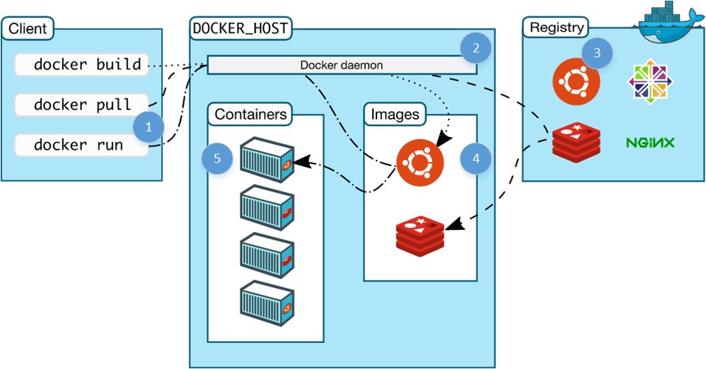

If you are looking to get your hands dirty and learn all about [Docker](https://docker.com), then look no further!

In this article I'm going to show you how Docker works, what all the fuss is about, and how Docker can help with a basic development task - building a microservice.

We'll use a simple Node.js service with a MySQL backend as an example, going from code running locally to containers running a microservice and database.

<p align="center">

</p>

Once you've read the article, you can find the source code here:

[github.com/dwmkerr/node-docker-microservice](https://github.com/dwmkerr/node-docker-microservice)

## What is Docker?

At its heart, Docker is software which lets you create an *image* (which is a lot like a template for a virtual machine) and then run instances of that image in a *container*.

Docker maintains a vast repository of images, called the [Docker Hub](https://hub.docker.com) which you can use as starting points or as free storage for your own images.  You can install Docker, choose an image you'd like to use, then run an instance of it in a container.

We're going to build images, create containers from images and more in this article.

### Install Docker

To follow along and use this article, you'll need Docker.

Check the installation guide for your platform,  [docs.docker.com/engine/installation](https://docs.docker.com/engine/installation/).

If you are on Mac or Windows, consider using a Virtual Machine. I use Parallels on Mac OS X to run an Ubuntu machine for most development activities. Being able to take snapshots, break things and then revert back is very handy when experimenting.

### Try It Out

Enter this command:

```
docker run -it ubuntu
```

After a bit of spinning, you'll see a prompt like this:

```
root@719059da250d:/# 
```

Try out a few commands and then exit the container:

```
root@719059da250d:/# lsb_release -a
No LSB modules are available.
Distributor ID:	Ubuntu
Description:	Ubuntu 14.04.4 LTS
Release:	14.04
Codename:	trusty
root@719059da250d:/# exit
```

This doesn't look like much, but a lot has happened!

What you are seeing is the bash shell of an *isolated* container running Ubuntu, on your machine. It's yours to place with - you can install things on it, run software, whatever you want.

Here's a diagram and breakdown of what just happened (the digram is from the ['Understanding the Architecture' Docker Documentation](https://docs.docker.com/v1.8/introduction/understanding-docker/), which is great):



1. We issue a docker command:
  * `docker`: run the docker client
  * `run`: the command to run a new container
  * `-it`: option to give the container an interactive terminal
  * `ubuntu`: the image to base the container on
2. The docker service running on the host (our machine) checks to see if we have a copy of the requested image locally- which there isn't.
3. The docker service checks the public registry (the docker hub) to see if there's an image named `ubuntu` available- which there is.
4. The docker service downloads the image and stores it in its local cache of images (ready for next time).
5. The docker service creates a new container, based on the `ubuntu` image.

Try any of these:

```
docker run -it haskell
docker run -it java
docker run -it python
```

We're not going to use [Haskell](https://xkcd.com/1312/) today, but you can see, running an environment is very easy.

It's a snap to build images of our own, with our apps or services on them, databases, whatever we need. We can then run them on any machine with Docker installed - and the image will run in the same, predictable way. We can build our software *and the environment it runs on* as code and deploy easily.

Let's look into a simple microservice as an example.

## The Brief

We're going to build a microservice which lets us manage a directory of email addresses to phone numbers, using Node.js and MySQL.

## Getting Started

For doing local development we'll need to install MySQL and create a test database for us to...

...nope.

Creating a local database and running scripts on it is an easy start, but can get messy. Lots of uncontrolled stuff going on. It might work, we could even control it with some shell scripts checked in to our repo, but what if other developers already have MySQL installed? What if they have a database already with the creative name 'users' which we want to create?

### Step 1: Creating a Test Database Server - in Docker

This is a great Docker use case. We might not want to run our production database in Docker (perhaps we'll just use Amazon RDS for example), but we can spin up a clean MySQL database in no time as a Docker container for development - leaving our development machine clean and keeping everything we do controlled and repeatable.

Run the following command:

```
docker run --name db -d -e MYSQL_ROOT_PASSWORD=123 -p 3306:3306 mysql:latest
```

This starts a MySQL instance running, allowing access through port 3306 using the root password 123.

1. `docker run` tells the engine we want to run an image (the image comes at the end, [mysql:vlatest](https://hub.docker.com/_/mysql/)
2. `--name db` names this container `db`. 
3. `-d` (or `--detach`) detach - i.e. run the container in the background.
3. `-e MYSQL_ROOT_PASSWORD=123` (or `--env`) environment variables - tells docker we want to provide an environment variable. The variable following it is what the MySQL image checks for setting the default root password.
4. `-p 3306:3306` (or `--publish` tells the engine that we want to map the port 3306 from inside the container to out port 3306.

The last part is really important - even though that's the MySQL default port, if we don't tell docker explicitly we want to map it, it will block access through that port (because containers are isolated until you tell them you want access).

The return value of this function is the *container id*, a reference to the container which you can use to stop it, restart it, issue commands on it and so on. Let's see which containers are running:

```
$ docker ps
CONTAINER ID  IMAGE         ...  NAMES
36e68b966fd0  mysql:latest  ...  db
```

The key information is the container ID, image and name. Let's connect to this image and see what's there:

```
$ docker exec -it db /bin/bash

root@36e68b966fd0:/# mysql -uroot -p123
mysql> show databases;
+--------------------+
| Database           |
+--------------------+
| information_schema |
+--------------------+
1 rows in set (0.01 sec)

mysql> exit
Bye
root@36e68b966fd0:/# exit
```

This is pretty clever too:

1. `docker exec -it db` tells docker we want to execute a command on the container named `db` (we could also use the id, or just the first few letters of the id). `-it` ensures we have an interactive terminal.
2. `mysql -uroot -p123` the command we actually run as a process in the container, which in this case is just the mysql client.

We can create databases, tables, users, whatever we need.

### Wrapping up the Test Database

Running MySQL inside a container has already introduced a few Docker tricks, but let's pause here and move onto the service. For now, we'll have create a `test-database` folder with a script to start the database, stop the database and setup test data:

```
test-database\setup.sql
test-database\start.sh
test-database\stop.sh
```

Start is simple:

```language-bash
#!/bin/sh

# Run the MySQL container, with a database named 'users' and credentials
# for a users-service user which can access it.
echo "Starting DB..."
docker run --name db -d \
  -e MYSQL_ROOT_PASSWORD=123 \
  -e MYSQL_DATABASE=users -e MYSQL_USER=users_service -e MYSQL_PASSWORD=123 \
  -p 3306:3306 \
  mysql:latest

# Wait for the database service to start up.
echo "Waiting for DB to start up..."
docker exec db mysqladmin --silent --wait=30 -uusers_service -p123 ping || exit 1

# Run the setup script.
echo "Setting up initial data..."
docker exec -i db mysql -uusers_service -p123 users < setup.sql
```

This script runs the database image in a detached container (i.e. in the background), with a user set up to access a `users` database, then waits for the database server to start up, then runs a `setup.sql` script to set initial data.

`setup.sql` is:

```language-sql

create table directory (user_id INT NOT NULL AUTO_INCREMENT PRIMARY KEY, email TEXT, phone_number TEXT);
insert into directory (email, phone_number) values ('homer@thesimpsons.com', '+1 888 123 1111');
insert into directory (email, phone_number) values ('marge@thesimpsons.com', '+1 888 123 1112');
insert into directory (email, phone_number) values ('maggie@thesimpsons.com', '+1 888 123 1113');
insert into directory (email, phone_number) values ('lisa@thesimpsons.com', '+1 888 123 1114');
insert into directory (email, phone_number) values ('bart@thesimpsons.com', '+1 888 123 1115');
```

The `stop.sh` script will stop the container and remove it (containers are left around by docker by default so that they can be restared quickly, we don't really need that feature for this example):

```language-bash
#!/bin/sh

# Stop the db and remove the container.
docker stop db && docker rm db
```

We're going to make this even more slick later on, simplifying this further. Check the code at this stage by looking at the [step1](https://github.com/dwmkerr/node-docker-microservice/tree/step1) branch of the repo.

### Step 2: Creating a Microservice in Node.js

This article is really focused on learning Docker, so I'm not going to spend ages on the Node.js microservice. Instead, I'll highlight the areas and takeaways.

```
test-database/          # contains the code seen in Step 1
users-service/          # root of our node.js microservice
- package.json          # dependencies, metadata
- index.js              # main entrypoint of the app
- api/                  # our apis and api tests
- config/               # config for the app
- repository/           # abstraction over our db
- server/               # server setup code
```

Let's take this apart bit by bit. The first section to look at is `repository`. It can be useful to wrap your database access in some kind of class or abstraction, to allow to mock it for testing purposes:

```language-javascript
//  repository.js
//
//  Exposes a single function - 'connect', which returns
//  a connected repository. Call 'disconnect' on this object when you're done.
'use strict';

var mysql = require('mysql');

//  Class which holds an open connection to a repository
//  and exposes some simple functions for accessing data.
class Repository {
  constructor(connection) {
    this.connection = connection;
  }

  getUsers() {
    return new Promise((resolve, reject) => {

      this.connection.query('SELECT email, phone_number FROM directory', (err, results) => {
        if(err) {
          return reject(new Error("An error occured getting the users: " + err));
        }

        resolve((results || []).map((user) => {
          return {
            email: user.email,
            phone_number: user.phone_number
          };
        }));
      });

    });
  }

  getUserByEmail(email) {

    return new Promise((resolve, reject) => {

      //  Fetch the customer.
      this.connection.query('SELECT email, phone_number FROM directory WHERE email = ?', [email], (err, results) => {

        if(err) {
          return reject(new Error("An error occured getting the user: " + err));
        }

        if(results.length === 0) {
          resolve(undefined);
        } else {
          resolve({
            email: results[0].email,
            phone_number: results[0].phone_number
          });
        }

      });

    });
  }

  disconnect() {
    this.connection.end();
  }
}

//  One and only exported function, returns a connected repo.
module.exports.connect = (connectionSettings) => {
  return new Promise((resolve, reject) => {
    if(!connectionSettings.host) throw new Error("A host must be specified.");
    if(!connectionSettings.user) throw new Error("A user must be specified.");
    if(!connectionSettings.password) throw new Error("A password must be specified.");
    if(!connectionSettings.port) throw new Error("A port must be specified.");

    resolve(new Repository(mysql.createConnection(connectionSettings)));
  });
};

```

There's probably a lot of better ways to do this! But basically we can create a `Repository` object like this:

```language-javascript
repository.connect({
  host: "127.0.0.1",
  database: "users",
  user: "users_service",
  password: "123",
  port: 3306
}).then((repo) => {
  repo.getUsers().then(users) => {
    console.log(users);
  });
  repo.getUserByEmail('homer@thesimpsons.com').then((user) => {
    console.log(user);
  })
  //  ...when you are done...
  repo.disconnect();
});
```

There's also a set of unit tests in the `repository/repository.spec.js` file. Now that we've got a repo, we can create a server. This is `server/server.js`:

```language-javascript
//  server.js

var express = require('express');
var morgan = require('morgan');

module.exports.start = (options) => {

  return new Promise((resolve, reject) => {

    //  Make sure we have a repository and port provided.
    if(!options.repository) throw new Error("A server must be started with a connected repository.");
    if(!options.port) throw new Error("A server must be started with a port.");

    //  Create the app, add some logging.
    var app = express();
    app.use(morgan('dev'));

    //  Add the APIs to the app.
    require('../api/users')(app, options);

    //  Start the app, creating a running server which we return.
    var server = app.listen(options.port, () => {
      resolve(server);
    });

  });
};
```

This module exposes a `start` function, which we can use like this:

```language-javascript
var server = require('./server/server);
server.start({port: 8080, repo: repository}).then((svr) => {
  // we've got a running http server :)
});
```

Notice that `server.js` uses `api/users/js`? Here it is:

```language-javascript
//  users.js
//
//  Defines the users api. Add to a server by calling:
//  require('./users')
'use strict';

//  Only export - adds the API to the app with the given options.
module.exports = (app, options) => {

  app.get('/users', (req, res, next) => {
    options.repository.getUsers().then((users) => {
      res.status(200).send(users.map((user) => { return {
          email: user.email,
          phoneNumber: user.phone_number
        };
      }));
    })
    .catch(next);
  });

  app.get('/search', (req, res) => {

    //  Get the email.
    var email = req.query.email;
    if (!email) {
      throw new Error("When searching for a user, the email must be specified, e.g: '/search?email=homer@thesimpsons.com'.");
    }

    //  Get the user from the repo.
    options.repository.getUserByEmail(email).then((user) => {

      if(!user) { 
        res.status(404).send('User not found.');
      } else {
        res.status(200).send({
          email: user.email,
          phoneNumber: user.phone_number
        });
      }
    })
    .catch(next);

  });
};
```

Both of these files have unit tests adjacent to the source.

We'll need config. Rather than using a specialised library, a simple file will do the trick - `config/config.js`:

```language-javascript
//  config.js
//
//  Simple application configuration. Extend as needed.
module.exports = {
	port: process.env.PORT || 8123,
  db: {
    host: process.env.DATABASE_HOST || '127.0.0.1',
    database: 'users',
    user: 'users_service',
    password: '123',
    port: 3306
  }
};
```

We can `require` config as needed. Currently, most config is hard coded, but as you can see from `port` it's easy to add environment variables as an option.

Final step - stringing it together with an `index.js` file which composes everything:

```language-javascript
//	index.js
//
//  Entrypoint to the application. Opens a repository to the MySQL
//  server and starts the server.
var server = require('./server/server');
var repository = require('./repository/repository');
var config = require('./config/config');

//  Lots of verbose logging when we're starting up...
console.log("--- Customer Service---");
console.log("Connecting to customer repository...");

//  Log unhandled exceptions.
process.on('uncaughtException', function(err) {
  console.error('Unhandled Exception', err);
});
process.on('unhandledRejection', function(err, promise){
  console.error('Unhandled Rejection', err);
});

repository.connect({
  host: config.db.host,
  database: config.db.database,
  user: config.db.user,
  password: config.db.password,
  port: config.db.port
}).then((repo) => {
  console.log("Connected. Starting server...");

  return server.start({
    port: config.port,
    repository: repo
  });

}).then((app) => {
  console.log("Server started successfully, running on port " + config.port + ".");
  app.on('close', () => {
    repository.disconnect();
  });
});
```

We have a little error handling and beyond that we're just loading config, creating a repo and starting our server.

That's the microservice. It allows us to get all users, or search a user:

```
HTTP GET /users                              # gets all users
HTTP GET /search?email=homer@thesimpons.com  # searches by email
```

If you checkout the code, you'll see that there's a few commands available for you:

```
cd ./users-service
npm install         # setup everything
npm test 		   # unit test - no need for a test database running
npm start           # run the server - you must have a test database running
npm run debug       # run the server in debug mode, opens a browser with the inspector
npm run lint        # check to see if the code is beautiful
```

Asides from the code you've seen we have:

1. Node Inspector for debugging
2. Mocha/shoud/supertest for unit tests
3. ESLint for linting

That's it!

Run the test database with:

```
cd test-database/
./start.sh
```

Then the service with:

```
cd ../users-service/
npm start
```

You can point your browser to [localhost:8123/users](http://localhost:8123/users) and see it in action. If you are using Docker Machine (i.e. you're on Mac or Windows) then `localhost` won't work, you need the IP of the docker machine instead. You can use `docker-machine ip` to get it.

We've whipped through building the service quickly. If you'd like to see this code before we continue, check the [step2](https://github.com/dwmkerr/node-docker-microservice/tree/step2) branch.

# Step 3: Dockerising our Microservice

OK now it gets fun!

So we have a microservice which we can run on a dev box, as long as it has a compatible version of Node.js installed. What we'd like to do is set up our service so that we can create a *Docker Image* from it, allowing us to deploy our service anywhere which supports docker.

The way we do this is create a *Dockerfile*. A Dockerfile is a recipe that tells the Docker engine how to build your image. We'll create a simple Dockerfile in our `users-service` directory and start to explore how we can adapt it to our needs.

## Creating the Dockerfile

Create a new text file called `Dockerfile` at `users-service/` with the content below:


```
# Use Node v4 as the base image.
FROM node:4

# Run node 
CMD ["node"]

```

Now run the commands below to build the image and run the a container from it:

```
docker build -t node4 .    # Builds a new image
docker run -it node4       # Run a container with this image, interactive
```

Let's look at the build command first.

1. `docker build` tell the engine we want to create a new image.
2. `-t node4` tag this image with the tag `node4`. We can refer to this image by tag from now on.
3. `.` use the current directory to find the `Dockerfile`.

After some console output you'll see we have a new image created. You can see all images on your system with `docker images`. The next command should be fairly familiar from what we've done so far:

1. `docker run` run a new container from an image.
2. `-it` use an interactive terminal.
3. `node4` the tag of the image we want to use in the container.

When we run this image, we get a node repl, check the current version like so:

```language-javascript
> process.version
'v4.4.0'
> process.exit(0)
```

This is potentially different to the node version on your current machine.

## Examining the Dockerfile

Looking at the dockerfile we can see quite easily what is going on:

1. `FROM node:4` the first thing we specify in a Dockerfile is the base image. A quick google finds the [node organisation page on the docker hub](https://hub.docker.com/_/node/) showing all of the available images. This is essentially bare bones ubuntu with node installed.
2. `CMD ["node"]` the `CMD` command tells docker that this image should run the node executable. When the executable terminates, the container shuts down.

With the addition of a few more commands, we can update our Dockerfile so that it runs our service:

```
# Use Node v4 as the base image.
FROM node:4

# Add everything in the current directory to our image, in the 'app' folder.
ADD . /app

# Install dependencies
RUN cd /app; \
    npm install --production

# Expose our server port.
EXPOSE 8123

# Run our app.
CMD ["node", "/app/index.js"]
```

The only addition here is that we use the `ADD` command to copy everything[^1] in the current directory to a folder in the container called `app/` . We then use `RUN` to run a command in the image, which installs our modules. Finally, we `EXPOSE` the server port, telling docker we intend to support inbound connections on `8123`, then run our server code.

Ensure the test-database service is running, then build and run the image again:

```
docker build -t users-service .
docker run -it -p 8123:8123 users-service
```

If you navigate to `localhost:8123/users` in a browser you should see an error, checking the console shows our container is reporting some issues:

```
--- Customer Service---
Connecting to customer repository...
Connected. Starting server...
Server started successfully, running on port 8123.
GET /users 500 23.958 ms - 582
Error: An error occured getting the users: Error: connect ECONNREFUSED 127.0.0.1:3306
    at Query._callback (/app/repository/repository.js:21:25)
    at Query.Sequence.end (/app/node_modules/mysql/lib/protocol/sequences/Sequence.js:96:24)
    at /app/node_modules/mysql/lib/protocol/Protocol.js:399:18
    at Array.forEach (native)
    at /app/node_modules/mysql/lib/protocol/Protocol.js:398:13
    at nextTickCallbackWith0Args (node.js:420:9)
    at process._tickCallback (node.js:349:13)
```

Yikes! So the connection from our `users-service` container to the `test-database` container is being refused. We might try running `docker ps` to see all containers running:

```
CONTAINER ID  IMAGE          PORTS                   NAMES
a97958850c66  users-service  0.0.0.0:8123->8123/tcp  kickass_perlman
47f91343db01  mysql:latest   0.0.0.0:3306->3306/tcp  db

```

They're both there, so what is going on?

## Linking Containers

The issue we've seen is actually to be expected. Docker containers are supposed to be isolated, so it wouldn't make much sense if we could create connections between containers without us explicitly allowing it. 

Yes, we can connect from our machine (the host) to a container, because we've opened ports for that (using the `-p 8123:8123` argument for example). If we allowed containers to talk to each other in the same way, then two containers running on the same machine would be able to communicate, even if the developers didn't intend it, and that's a recipe for disaster, especially when we might have a cluster of machines whos job it is to run containers from different applications.

If we're going to connect from one container to another, we need to *link* them, which tells docker that we explicitly want to allow communication between the two. There are two ways of doing this, the first is the 'old fasioned' but quite simple way, the second we'll see a little later.

### Linking Containers with the 'link' parameter

When we run a container, we can tell docker that we intend to connect to another container using the `link` parameter. In our case, we  can run our service correctly like this:

```
docker run -it -p 8123:8123 --link db:db -e DATABASE_HOST=DB users-service
```

1. `docker run -it` run a docker image in a container, with an interactive terminal.
2. `-p 8123:8123` map the host port 8123 to the container port 8123.
3. `link db:db` link to the container named `db` and refer to it as `db`.
4. `-e DATABASE_HOST=db` set the `DATABASE_HOST` environment variable to `db`.
5. `users-service` the name of the image to run in our container.

Now when we go to `localhost:8123/users` everything works.

#### How it works

Remember our config file for the service? It allowed us to specify a database host with an environment variable:

```language-javascript
//  config.js
//
//  Simple application configuration. Extend as needed.
module.exports = {
	port: process.env.PORT || 8123,
  db: {
    host: process.env.DATABASE_HOST || '127.0.0.1',
    database: 'users',
    user: 'users_service',
    password: '123',
    port: 3306
  }
};
```

When we run the container, we set this environment variable to `DB`, which means we're connecting to a host called `DB`. This is *automatically* set up for us by the docker engine when we link to a container.

To see this in action, try running `docker ps` to list all running containers. Look up the name of the container running the `users-service`, which will be a random name such as `trusting_jang`:

```
docker ps
CONTAINER ID  IMAGE          ...   NAMES
ac9449d3d552  users-service  ...   trusting_jang
47f91343db01  mysql:latest   ...   db
```

Now we can look at the hosts available on our container:

```
docker exec trusting_jang cat /etc/hosts
127.0.0.1	localhost
::1	localhost ip6-localhost ip6-loopback
fe00::0	ip6-localnet
ff00::0	ip6-mcastprefix
ff02::1	ip6-allnodes
ff02::2	ip6-allrouters
172.17.0.2	db 47f91343db01    # linking magic!!
172.17.0.3	ac9449d3d552
```

Remember how `docker exec` works? Choose a container name and then whatever follows is the command you'll execute on the container, in our case `cat /etc/hosts`.

OK the hosts file doesn't have the `# linking magic!!` comment, that's so you can see - docker has added `db` to our hosts file so we can refer to the linked container by hostname. This is one consequence of linking. Here's the other:

```
docker exec trusting_jang printenv | grep DB
DB_PORT=tcp://172.17.0.2:3306
DB_PORT_3306_TCP=tcp://172.17.0.2:3306
DB_PORT_3306_TCP_ADDR=172.17.0.2
DB_PORT_3306_TCP_PORT=3306
DB_PORT_3306_TCP_PROTO=tcp
DB_NAME=/trusting_jang/db
```

From this command we can also see that when docker links a container, it also provides a set of environment variables with some helpful information. We know the host, tcp port and container name.

That's step 3 complete - we have a MySQL database running happily in a container, we have a node.js microservice which we can run locally or in a container of its own, and we know how to link them together.

You can check out how the code looks at this stage by going to the [step3](https://github.com/dwmkerr/node-docker-microservice/tree/step3) branch.

# Step 4: Integration Testing the Environment

We can now write an integration test which calls the actual server, running as a docker container, calling the containerised test database.

Writing the integration test can be done in whatever language or on whatever platform you want, within reason, but to keep things simple I'm using Node.js as we've already seen Mocha and Supertest in our project.

In a new folder, called `integration-tests` we've got a single `index.js`:

```language-javascript
var supertest = require('supertest');
var should = require('should');

describe('users-service', () => {

  var api = supertest('http://localhost:8123');

  it('returns a 200 for a known user', (done) => {

    api.get('/search?email=homer@thesimpsons.com')
      .expect(200, done);
  });

});
```

This will check an API call and show the results of the test[^2].

As long as your `users-service` and `test-database` are running, the tests will pass. However, at this stage the services are getting a little harder to handle:

1. We have to use a shell script to start and stop the database
2. We have to remember a sequence of commands to start the users service against the database
3. We have to use node directly to run the integration tests

Now that we're a little more familiar with Docker we can fix these issues.

### Simplifiying the Test Database

Currently we have the following files for the test database:

```
/test-database/start.sh
/test-database/stop.sh
/test-database/setup.sql
```

Now that we're more familar with Docker, we can improve on this. Looking into the [mysql image documentation](https://hub.docker.com/_/mysql/) on Docker Hub there's a note which tells us any `.sql` or `.sh` file added to the image's `/docker-entrypoint-initdb.d` folder will be executed when setting up the DB.

This means we can replace our `start.sh` and `stop.sh` scripts with a `Dockerfile`:

```
FROM mysql:5

ENV MYSQL_ROOT_PASSWORD 123
ENV MYSQL_DATABASE users
ENV MYSQL_USER users_service
ENV MYSQL_PASSWORD 123

ADD setup.sql /docker-entrypoint-initdb.d
```

Now to run our test database it is just:

```
docker build -t test-database .
docker run --name db test-database
```

### Composing

Building and running each container is still somewhat time consuming. We can take things a step further with the [Docker Compose](https://docs.docker.com/compose/) tool.

Docker Compose lets you create a file which defines each container in your system, the relationships between them, and build or run them all.

First, [install Docker Compose](https://docs.docker.com/compose/install/). Now create a new file in the root of your project called `docker-compose.yml`:

```
version: '2'
services:
  users-service:
    build: ./users-service
    ports:
     - "8123:8123"
    depends_on:
     - db
    environment:
     - DATABASE_HOST=db
  db:
    build: ./test-database
```

Now check this out:

```
docker-compose build
docker-compose up
```

Docker Compose has built all of the images needed for our application, created containers fromthem, run them in the correct order and started the whole stack!

The `docker-compose build` command builds each image which is listed in the `docker-compose.yml` file:

```
version: '2'
services:
  users-service:
    build: ./users-service
    ports:
     - "8123:8123"
    depends_on:
     - db
    environment:
     - DATABASE_HOST=db
  db:
    build: ./test-database
```

The `build` value for each of our services tells docker where to go to find the `Dockerfile`. When we run `docker-compose up`, docker starts all of our services. Notice from the `Dockerfile` we can specify ports and dependencies. Actually, there's a whole bunch of config we can change here.

In another terminal, run `docker compose down` to gracefully shut down the containers.

# Winding Up

We've seen a lot of docker in this article, but there's a lot more to it. I hope this has shown some of the interesting and useful things that you can use docker for in your workflow. 

As usual, questions and comments are welcomed! I'd also strongly recommend the document [Understanding Docker](https://docs.docker.com/engine/understanding-docker/) to get a deeper understanding of how docker works.

You can see the final source code for the project built in this article at [github.com/dwmkerr/node-docker-microservice](https://github.com/dwmkerr/node-docker-microservice)

# Notes

[^1]: Copying everything is actually a bad idea, because we will also copy the node_modules folder. Generally it is a better idea explicitly list the files or folders you want to copy, or use a .dockerignore file, which works just like the .gitignore file.
[^2]: If the server isn't running, it will actually show a rather annoying exception, due to a bug in supertest, see [github.com/visionmedia/supertest/issues/314](https://github.com/visionmedia/supertest/issues/314).

