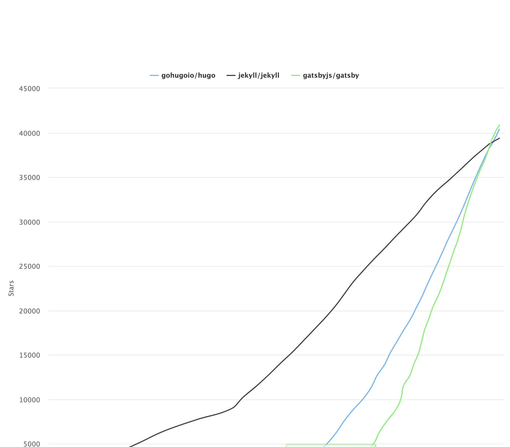

With a little bit of free time for a change, I decided to finally migrate my blog from [Ghost](https://ghost.org/) to a static site generator. I've been putting this off because it's one of those things that I knew would take longer than I'd expect, and to be honest, it it ain't broke, then don't fix it.

## So, Why Bother?

My first website was built on WordPress, which has grown into a very powerful platform over the years, but was overly complex for my needs.

When I first tried Ghost, I loved it. A super clean and minimal interface, with all of the content in Markdown. The editing experience was lovely:


Ghost is great, and I've been a happy user for years. I'd highly recommend it to _anyone_ who wants a lean and clean content management system. However, there were a few key reasons I decided to change. This article is not be advocating for my new setup, or a criticism of Ghost, but might be useful for people who are considering similar changes.

### Reason #1 - I write in vim

The Ghost UI is lovely, but I do all of my writing in vim. Writing in the Ghost UI could sometimes be a little slow, and obviously doesn't work offline. I'm very comfortable writing in vim. So I would end up writing the post in vim, then copying and pasting into Ghost.

Right now, this is what my screen looks like:


Again, I'm not advocating for vim, it's just what works for me. The screenshot is with my 'focus' mode setup, which removes all unnecessary clutter (all of my configuration is available on my [dotfiles repo](https://github.com/dotfiles).

### Reason #2 - I backup on GitHub

I'm writing all of my content in vim, and storing it in a folder. Some posts take days to write. So it makes sense to keep all of these files in a git repository. This means that I essentially have a robust backup solution, I don't need to use Ghosts's backup. Ghost's backup (for self hosted) also doesn't handle images.

### Reason #3 - My workflow sucks for images

Because I am writing in vim, and creating screenshots and images, I need to link to them. This means that what I have in my local markdown file won't work for Ghost. With Ghost I need to upload the image, and it will put it in a content folder. But I want to be able to keep my images close to the text, and have consistent addresses for local writing, like so:


### Reason 4 - I have two sources of truth

If I need to make a change, do I update my markdown file in my GitHub repo? Or in Ghost? Or both? If I have to change a few things, then I can't just paste in the whole markdown file without breaking the image links. So I basically have two sources of truth, which can easily diverge.

### Reason 5 - I want to allow people to contribute

I'm already using GitHub and Markdown. In theory this means that it should be very straightforward for people to propose edits or contributions; they can just create pull requests. I don't expect many people would do this, but it appeals to me that people could make corrections or suggest improvements, particularly for technical content.

### Reason 6 - I don't want to manage a server

My website is static content. It's blog posts and that's about it. There's really no need for any kind of application server or database. Disqus handles comments, Google Analytics for traffic data. So I can save myself a few dollars a month by just generating a static site and hosting it on [GitHub Pages](https://pages.github.com/) or [Netlify](https://www.netlify.com/).

Static sites can be cached by CDNs so can be very fast for readers. And given the vast majority of my content is already just text and images in a GitHub repo, it doesn't make sense to pay for and manage server when there are a number of static site generators.

### Reason 7 - I need to learn how do this

I've been putting this off for a while. But it will be _really_ useful to know how to quickly get up and running with a static site generator. There are other projects that I'd love to run as sites, such as:

- [hacker-laws](https://github.com/dwmkerr/hacker-laws)
- [learn-a-language](https://github.com/dwmkerr/learn-a-language)

Being able to quickly whip up a static site from markdown in GitHub seems like it could be really useful.

So next - how do pick a static site generator?

## Picking a Generator

I had a few requirements for the generator:

- I can easily host on GitHub pages
- I can integrate Disqus and Google Analytic
- I have as little complexity as possible, KISS
- I can maintain all of the existing URLs of my posts, so that links from external sites will not break
- I can have a theme which is roughly similar to the original Ghost theme, something minimal and text focused

A little bit of research suggested that there were three main contenders:

- [Jekyll](https://jekyllrb.com/)
- [Gatsby](https://www.gatsbyjs.org)
- [Hugo](https://gohugo.io/)

I actually tried all three. Each engine is popular on GitHub:



The number of stars a project has is of course not a genuine indicator of quality, but it is interesting to see how quickly Gatsby and Hugo have caught up to Jekyll.

### Jekyll

Jekyll makes a tonne of sense. It is very easy to setup for GitHub pages (in fact, GitHub pages assumes you are using Jekyll unless you explicitly tell it you are not).

Setting up Jekyll was easy - but I couldn't properly import my blog. I used the [jekyll_ghost_importer](https://github.com/eloyesp/jekyll_ghost_importer) tool, but the generated files seemed to be missing the slug. I wasted some time trying to see if I could resolve this issue, and then decided it was worth moving to the next platform and checking back in on Jekyll another time.

### Gatsby

Gatsby is written in Node.js, which had some appeal, as I am far more familiar with Node than Ruby (which Jekyll uses) or Golang (which Hugo uses, and I don't get on with).

I quickly paused on Gatsby. I had some trouble finding a tool to import data from Ghost, but during my research I realised just how powerful Gatsby is. It can be the front-end for Ghost, with Ghost working as a headless CMS, it can serve GraphQL, runs a React front end and more. These are all technologies I use regularly, but I was concerned that the tool seemed perhaps more complicated than I needed.

So I paused on Gatsby, but will definitely look into it in the future if I am building a more complex site from scratch.

### Hugo

Hugo I was the least excited about. A lot of the hype seemed to be around the speed of the tool, and the fact it is written in Golang. Speed is not really an issue for me in this case and would not be a big factor in my decision. And I've spent enough time coding with the Kubernetes codebase that I have developed a deep dislike of Golang.

I was quickly sold on Hugo. Setup was very easy, importing was seamless with [ghostToHugo](https://github.com/jbarone/ghostToHugo/
), URLs were preserved as needed. I found a nice theme called [ghostwriter](https://github.com/jbub/ghostwriter) which quickly gave me a locally running site which looked not too bad.

The generated folder structure was trivial enough for me to quickly work out how to create the few static pages I have (public speaking, about etc).

Again; no advocating. All three engines seem to be great at what they do. Hugo was the easiest for me to get started on. Once I'd picked Hugo, it was time to get started migrating in earnest.

## The Migration Process

I've kept some notes on how I did this in case it is useful for others. The post [Moving from Ghost to Hugo by Robin Moffat](https://rmoff.net/2018/12/17/moving-from-ghost-to-hugo/) was super useful.


First, I downloaded [`ghostToHugo`](https://github.com/jbarone/ghostToHugo/). Then I ran the import command:

```sh
# Note: my ghost db backup is a file locally called 'db.json'
./ghostToHugo --dateformat "2006-01-02T15:04:05.000Z" -f -p dwmkerr.com db.json
```

Next I needed to copy over my images. My `~/.ssh/config` is setup with my ghost server, so I could just use `scp` to copy the files.

```sh
scp -r dwmkerr.com:/var/www/ghost/content/images ./dwmkerr.com/static
```

The whole site I put in it's own folder, `dwmkerr.com`, so that I could use other folders for backups, guides, whatever else I might want, and not pollute the generated site structure.

Next I downloaded a couple of themes:

```sh
git submodule add git@github.com:jbub/ghostwriter.git dwmkerr.com/themes/ghostwriter
git submodule add git@github.com:spf13/herring-cove.git dwmkerr.com/themes/herring-cove
```

And I created a `makefile` for common commands:

```sh
make setup  # install everything I need
make serve  # serve the site locally for testing
make build  # build the site for production
```

I'm a big fan of `makefiles` as a way to provide an index of key operations for any project (even if all does is call another script or program).

At this stage I had a working site running locally. However, I noticed some images weren't rendering. It seems that some of my images had paths like `/content/images/whatever.png` and some were just `/images/whatever.png`.

This was quick to fix in vim. First I used `vimgrep` to populate the quickfix list with any markdown file with a `/content/images` in the text, then used `cfdo` to just replace the string with `/images` (asking for confirmation each time to check I wasn't changing something I shouldn't.

```vim
:vimgrep \/content\/images **/*.md
:cfdo %s/\/content\/images\//\/images\//gc
```

## Automating Build and Deploy

At this stage I had a working site. Setting up a workflow to publish to GitHub pages with GitHub Actions was straightforward, as I've already updated some projects (such as [`spaceinvaders`](https://github.com/dwmkerr/spaceinvaders)) to publish static sites. The workflow is relatively simple:

```yml
name: Build & Deploy

on:
  push:
    branches:
    # - master
    - feat/static-site # We'll deploy from this branch when testing!

jobs:
  build-deploy:
    runs-on: ubuntu-18.04
    steps:
    - uses: actions/checkout@v1
      with:
        submodules: true

    - name: Setup Hugo
      uses: peaceiris/actions-hugo@v2
      with:
        hugo-version: '0.61.0'

    - name: Build
      run: make build

    - name: Deploy
      uses: JamesIves/github-pages-deploy-action@releases/v2
      env:
        GITHUB_TOKEN: ${{ secrets.GITHUB_TOKEN }}
        BASE_BRANCH: feat/static-site
        BRANCH: gh-pages
        FOLDER: ./dwmkerr.com/public
```

Any time a change is made to `master` or `feat/static-site` gets built and published.

## Restructuring the Content

After import, my site structure looked like this:


Now this is manageable, but feels awkward. I'd rather keep images next to the blog posts themselves. I want to group posts into years so that there are not too many shown in the file tree at any one time (and adding months/weeks/days makes things too fine grained). It also means that the page doesn't render images on GitHub:


The ideal structure would be just like this post:


It turns out that this is absolutely fine to do - as long as you name the post markdown `index.md`. This took an hour to work out! The feature is known as [Page Bundles](https://gohugo.io/content-management/page-bundles/). This is a delight - the content renders on GitHub just as well as it does on the site!

Migrating everything by hand would be something of a nightmare, so out comes the code:


https://gohugo.io/content-management/page-bundles/
