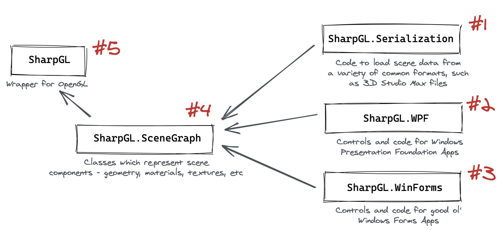

The world of .NET is going through a transformation. The .NET Framework is reaching end of life, [.NET Core](https://docs.microsoft.com/en-gb/dotnet/core/) is an increasingly feature rich and robust platform to develop solutions which target Linux, MacOS, embedded devices, containers and more. There's also the .NET Standard.

But what does this mean for .NET _Framework_ projects? In this article I'll describe how to modernise your .NET Framework projects for .NET Core, the .NET Standard and .NET 5, which is planned to be released this year. I'll also explain the high level differences between the platforms and what the consequences of upgrading are for consumers, developers and maintainers.

<!-- vim-markdown-toc GFM -->

* [The .NET Framework, .NET Core and the Future](#the-net-framework-net-core-and-the-future)
* [The Challenge: Modernisation and Compatibility](#the-challenge-modernisation-and-compatibility)
* [The Modernisation Process - Introducing our two Villains](#the-modernisation-process---introducing-our-two-villains)
    * [Step 1 - Understand the Domain](#step-1---understand-the-domain)
    * [Step 2 - Understand the Goal - Multi-Platform Builds](#step-2---understand-the-goal---multi-platform-builds)
    * [Step 3 - Migrate Projects "Leaf-wise"](#step-3---migrate-projects-leaf-wise)
    * [Step 4 - Refactor, Rinse, Repeat](#step-4---refactor-rinse-repeat)
    * [Step 5 - Update Your Builds](#step-5---update-your-builds)
    * [Step 6 - Simplify!](#step-6---simplify)
    * [Step 7 - Test, Test, Test](#step-7---test-test-test)
    * [Step 8 - Document Compatibility](#step-8---document-compatibility)
* [The Key Learnings](#the-key-learnings)

<!-- vim-markdown-toc -->

# The .NET Framework, .NET Core and the Future

There's a lot which has been written on this topic, but it can still be a little overwhelming to understand just how all of these things fit together.

Here's a simple visual I've created to try and put things into context:


I'm only going to cover the bare essentials - but there are links to further reading on each topic if you want to go deeper. This article is mainly going to be focused on the practicality and consequence of migration and re-targeting.

First, the **.NET Framework**.

- The .NET Framework was created in 2002 as set of unified tools and standards to allow developers on the Microsoft Platform to more quickly build solutions, provide interoperability between languages and more. [Read more about the .NET Framework](https://dotnet.microsoft.com/learn/dotnet/what-is-dotnet-framework).
- The .NET Framework rapidly gained popularity, partly due to the convenience of developing in C# rather than Basic or C/C++. C# provided a more developer friendly language than C or C++ for many use cases, and was heavily inspired by Java. [Read more about C#](https://docs.microsoft.com/en-us/dotnet/csharp/).
- With the increase in popularity, the .NET Framework started to have more frequent releases and became a standard part of the Windows operating system, installed out of the box rather than on-demand if needed.
- However - the .NET Framework only functioned on Microsoft Windows, which greatly limited its potential uses cases, even as more and more engineers used it for Web, Client Applications and mobile.

Enter **.NET Core**.

- Microsoft signaled a _radical_ switch in their strategy with the appointment of [Satya Nadella](https://en.wikipedia.org/wiki/Satya_Nadella), becoming increasingly focused on open source, and more importantly, deciding that the Microsoft development toolchain should not _force_ users to use Windows as their execution environment
- .NET Core was developed as a lightweight version of the .NET Framework, which could run on multiple platforms - including Linux and MacOS. [Read more about .NET Core](https://docs.microsoft.com/en-gb/dotnet/core/).
- In a short period of time .NET Core became more and more feature rich, providing a lot of capabilities for web developers and front-end application developers.

The challenges of **divergence** and the **.NET Standard**.

- As .NET Core became more feature rich, the API became closer to the .NET Framework - but they are still fundamentally different runtimes. A binary compiled for the .NET Core does not run on the .NET Framework and vice-versa.
- To deal with this issue, Microsoft developed the **.NET Standard** - a specification of a set of APIs. If a runtime offered these APIs, then solutions built on _any runtime which meets the standard_ could run on any compliant platform.

What does this mean? Basically, the table below shows the consequences of this. If you build on .NET Core 2.0 (for example), you can also run on the .NET Framework 4.6.1. Mono 5.4, Unity 2018.1 and more, because all of these runtimes implement the _.NET Standard 2.0_.

Of course, some features are always going to be very platform specific, so the standard started out small but has grown over time.

Moving to **convergence** and **.NET**.

- Given that the later versions of the .NET Framework and .NET Core actually follow the same standard, the platforms are actually starting to become more and more similar.
- They are becoming _so_ similar that it no longer makes sense to maintain them separately. The next major version of _both_ platforms is **.NET 5**. This is a new runtime which is the next version of .NET Core _and_ the .NET Framework.

This means that the .NET Framework and .NET Core are going to converge into a single platform, which will be wonderful for developers and simplify a complex landscape.

But what does this mean if you have .NET Framework projects? How do we modernise, and do we have to make trade-offs around compatibility? 

# The Challenge: Modernisation and Compatibility

I have a number of projects which target the .NET Framework. On _all_ of these projects I have had multiple requests to migrate to the .NET Core, but I have had to hold off on this work until I could really understand in detail a few things:

1. What would this mean for _consumers_ of the libraries? Would they have to change the platform they use? Could this break things for them?
2. What would this mean for _developers_ on the platform? Would they need to change their development environment? Would this cause problems?
3. What would this mean for _maintainers_ of the libraries? Would this greatly increase build and deployment complexity?

Finally I have found the time to be able to start to address these issues in detail - hopefully the learnings will be useful to anyone who is maintaining a .NET codebase and thinking about the future.

# The Modernisation Process - Introducing our two Villains

There are two key projects I wanted to modernise. They are both reasonably well used, complex, and have some potentially serious complexities for multi-platform builds.

[**SharpGL**](https://github.com/dwmkerr/sharpgl) is a library that allows developers to use [OpenGL](https://www.opengl.org/) in .NET applications. The big challenge? OpenGL is cross platform, but SharpGL _specifically_ provides an interface to the _Windows_ version of OpenGL. Can this possibly be made more future-proof? Could it ever target other platforms?

[**SharpShell**](https://github.com/dwmkerr/sharpshell) is a library that allows developers to build 'Shell Extensions' for Windows. Shell extensions are customisations to the Windows user interface, so would not be portable across platforms, but I still want to ensure that the project is future proof.

What would be the experience with these two projects? I have other .NET projects, but they are far less popular and much more simple, my instinct is that if I can work through the process with _these_ projects, the others should be more straightforward.

These are the steps I've followed to modernise. I'll finish the article with a summary of the key learnings.

## Step 1 - Understand the Domain

I cannot stress this enough. In all meaningful technology work, _understand the domain_ you are dealing with. A quick Google on how to migrate, or following the formal migration guide was not enough for me. I knew I had to actually understand, at a reasonably detailed level, the differences in the runtime, the trade-offs, the process, the complexity.

This article is the result of that work - sometimes writing about a topic is the best way to force yourself to learn it.

Making changes rapidly and waiting to see what the consequences are can often work for small projects, internal tools and so on, but for a library which is relied upon by others is not good for the community. The last thing I wanted to do was make changes which had unintended consequences for users. So making sure that I learnt about this space, how things work under the hood, and what the expected changes in the future are was critical.

Hopefully for others the process of understanding the domain will be a little easier with this article to cover the high level topics. During my actual process of writing and migrating, I went a lot deeper than this article goes.

The key document to follow to actually _execute_ the migration is the excellent official [.NET Framework to .NET Core Porting Guide](https://docs.microsoft.com/en-gb/dotnet/core/porting/).

## Step 2 - Understand the Goal - Multi-Platform Builds

Given the understanding of the domain, it made it much easier to understand what the required steps would be. Essentially, all that would be needed would be to target a version of the .NET Framework which adheres to a recent version of the .NET Standard. Once this was done, in theory the project could be built for the .NET Framework _and_ for .NET Core, and also be ready for the upcoming .NET 5 release.

Multi-platform builds are supported in Visual Studio 2019. These builds allow us to have a single codebase, but build libraries for multiple platforms (i.e. the .NET Framework and .NET Core). The resulting binaries can be packed as a single package, and when consumers install the package, the appropriate library is installed.

This introduces the first of the significant consequences - modernising your project means you must migrate it to Visual Studio 2019.

In the past, this might have been more of an issue, licenses for Visual Studio were expensive, and many organisations were locked onto specific versions for compatibility issues (or because they were slow to upgrade). This seems to be the case less often nowadays, but is still an important consideration.

My projects were using Visual Studio 2017. This is how the project properties looked:


Unsurprisingly the .NET Standard isn't mentioned. Time to upgrade to 2019. While I installed it I could reminisce about the excitement of buying Visual C++ .NET Learning Edition:


And try and remember what is was like to be a 15 years old. I wonder if that box set is still kicking around somewhere, I want to see it again. So much has changed. But long install processes for Visual Studio haven't, at least they kept that:


When installing, remember to enable the .NET Core features.

## Step 3 - Migrate Projects "Leaf-wise"

As per the [Porting Guide](https://docs.microsoft.com/en-gb/dotnet/core/porting/), we need to migrate each of the projects which make up the solution, starting with the 'leaves' (projects which don't depend on other projects) and then moving up the tree to the 'root' projects (projects which are depended on by others).

Visually, for a solution like SharpGL, that would mean the projects will need to be converted in the following order:



I was expecting each project to have quite different experiences:

- `SharpGL.Serialization` is just a set of classes which load data from files. In theory, this library should become completely portable.
- `SharpGL.WPF` and `SharpGL.WinForms` are _specifically_ for Windows front-end technologies. I expected these to be able to be ported, but don't expect them to work on other platforms (in the future there might be `SharpGL.OSx`, or `SharpGL.Gnome`, who knows)
- `SharpGL.SceneGraph` is a set of classes which represent 3D scenes - things like lights, cameras, materials and so on. I expect _some_ of this to 'just work', but things like image loading to perhaps need some tweaking.
- `SharpGL` is just a wrapper around the Windows `opengl32.dll` library. I can't imagine this _working_ anywhere but Windows, but how would the project structure porting go and would it build?

The details on _how_ to migrate a project are in the [Porting Guide](https://docs.microsoft.com/en-gb/dotnet/core/porting/), but the general approach will be:

1. Attempt to convert to the latest project format with the `try-convert` tool
2. Re-target the project to the .NET Framework 4.7.2 (the first version which supports the .NET standard)
3. Repeat for projects which this project depends on, walking the tree of projects to the root
4. Run the Portability Analysis tool to see if there are APIs which are not available on certain platforms

This is how you project might look after migration, having run the `try-convert`:


Now we just need to edit the project files and change the line:

```xml
<TargetFramework>4.7.2</TargetFramework>
```

To:

```xml
<TargetFrameworks>netcoreapp2.0;netcoreapp3.0;netcoreapp3.1;net40;net45;net472</TargetFrameworks>
```

The targets you will choose will depend on the APIs you want to use. There is an Portability Analysis extension available which can build a portability report, here's what one looks like:


This will also show the _specific_ APIs which are not compatible with specific targets:


Now it's time to move to the next step.

## Step 4 - Refactor, Rinse, Repeat

This is the tricky part. You'll now need to work out whether you want to _remove_ API calls which are not portable, try and use alternatives, or conditionally compile the code for different platforms.

If you are using non-portable APIs you may need to use conditional blocks to execute different code depending on the framework used. The [Target frameworks in SDK-style projects](https://docs.microsoft.com/en-us/dotnet/standard/frameworks#how-to-specify-target-frameworks) guide shows how to do this.

You may also have to manually edit the project file to ensure that certain dependencies are _only_ used for certain targets. You solution file and dependencies may end up looking something like this:


Once you have reloaded the project you'll see your dependencies can now be specified on a per-framework basis, and a build generates assemblies for each of the targets:


This process might be simple, or complex, depending on the nuances of your project. For me it was fairly iterative - starting by targeting only `net40` (the original target framework which I'd used), then adding more and more targets.

Some targets will simply not be possible - for example .NET Core only supports WinForms and WPF from .NET Core 3.0 onwards; you won't be able to build a WinForms or WPF assembly which targets a lower version, the framework doesn't support it.

## Step 5 - Update Your Builds

At this stage, having fixed compatibility issues, you should have code which builds in Visual Studio.

Now I would recommend porting all of your build code to use the `dotnet` build system. This is going to maximise the portability and future-proof your project, you'll be able to run the builds on multiple platforms and are using the preferred standard tool (`msbuild` will essentially become legacy).

The way I like to structure things personally is have a set of scripts which you can run to build, test and package the code locally. You can then call these scripts from you CI tool of choice to automate things, but still keep the logic in your own code, rather than hidden away in a build system.

For example, in my SharpGL project I have the following scripts:

| Script         | Usage                                                                                                                   |
|----------------|-------------------------------------------------------------------------------------------------------------------------|
| `config.ps1`   | Ensure your machine can run builds by installing necessary components such as `nunit`. Should only need to be run once. |
| `build.ps1`    | Build all solutions.                                                                                                    |
| `test.ps1`     | Run all tests, including those in samples.                                                                              |
| `coverage.ps1` | Create a coverage report. Reports are written to `./artifacts/coverage`                                                 |
| `pack.ps1`     | Create all of the SharpGL NuGet packages, which are copied to `./artifacts/packages`.                                   |

I updated my scripts to use the `dotnet` tool. For example, the 'build' script looks something like this:


```ps
# Run the build, hiding the documentation warnings for pinvoke code.
$buildCommand ="dotnet msbuild $PSScriptRoot\SharpGL.sln -noWarn:CS1591 -noWarn:CS1573 -t:Rebuild -p:Configuration=Release"
Write-Host "Running: ""$buildCommand"""
Invoke-Expression $buildCommand
```

And the 'pack' script looks like this:

```ps
dotnet pack --no-restore --no-build "$PSScriptRoot/Core/SharpGL/SharpGL.csproj" -c:Release
dotnet pack --no-restore --no-build "$PSScriptRoot/Core/SharpGL.SceneGraph/SharpGL.SceneGraph.csproj" -c:Release
dotnet pack --no-restore --no-build "$PSScriptRoot/Core/SharpGL.Serialization/SharpGL.Serialization.csproj" -c:Release
dotnet pack --no-restore --no-build "$PSScriptRoot/Core/SharpGL.WinForms/SharpGL.WinForms.csproj" -c:Release
dotnet pack --no-restore --no-build "$PSScriptRoot/Core/SharpGL.WPF/SharpGL.WPF.csproj" -c:Release
```

The actual scripts are a little more complex. But the key thing here is that I can run _any_ part of the CI/CD process locally (to test, debug and so on) or on a CI/CD platform.

You will most likely have to _conditionally_ reference certain components. The dependency for `net40` might be different to that for `netcoreapp3.0`. You'll see that in many of my project files there is now code like this:

```xml
<ItemGroup>
    <Reference Include="System.Design" Condition="'$(TargetFramework)' == 'net40'" />
    <Reference Include="System.Design" Condition="'$(TargetFramework)' == 'net45'" />
    <Reference Include="System.Design" Condition="'$(TargetFramework)' == 'net472'" />
    <Reference Include="System.Windows.Forms" Condition="'$(TargetFramework)' == 'net40'" />
    <Reference Include="System.Windows.Forms" Condition="'$(TargetFramework)' == 'net45'" />
    <Reference Include="System.Windows.Forms" Condition="'$(TargetFramework)' == 'net472'" />
</ItemGroup>
<ItemGroup>
    <PackageReference Include="Microsoft.CSharp" Version="4.7.0" Condition="'$(TargetFramework)' == 'netcoreapp3.0'" />
    <PackageReference Include="Microsoft.CSharp" Version="4.7.0" Condition="'$(TargetFramework)' == 'netcoreapp3.1'" />
    <PackageReference Include="Microsoft.CSharp" Version="4.7.0" Condition="'$(TargetFramework)' == 'net45'" />
    <PackageReference Include="Microsoft.CSharp" Version="4.7.0" Condition="'$(TargetFramework)' == 'net472'" />
    <PackageReference Include="System.Data.DataSetExtensions" Version="4.5.0" Condition="'$(TargetFramework)' == 'netcoreapp3.0'" />
    <PackageReference Include="System.Data.DataSetExtensions" Version="4.5.0" Condition="'$(TargetFramework)' == 'netcoreapp3.1'" />
    <PackageReference Include="System.Data.DataSetExtensions" Version="4.5.0" Condition="'$(TargetFramework)' == 'net45'" />
    <PackageReference Include="System.Data.DataSetExtensions" Version="4.5.0" Condition="'$(TargetFramework)' == 'net472'" />
</ItemGroup>
```

In my case quite a bit of trial and error was needed to find the appropriate references for each platform.

## Step 6 - Simplify!

One benefit I have found during this process is that you can _simplify_ your projects. You no longer need any kind of 'automated NuGet restore' functionality. This means you can remove code like this from your project files:

```xml
<Import Project="$(SolutionDir)\.nuget\NuGet.targets" Condition="Exists('$(SolutionDir)\.nuget\NuGet.targets')" />
<Target Name="EnsureNuGetPackageBuildImports" BeforeTargets="PrepareForBuild">
  <PropertyGroup>
    <ErrorText>This project references NuGet package(s) that are missing on this computer. Use NuGet Package Restore to download them.  For more information, see http://go.microsoft.com/fwlink/?LinkID=322105. The missing file is {0}.</ErrorText>
  </PropertyGroup>
  <Error Condition="!Exists('..\packages\NUnit.3.11.0\build\NUnit.props')" Text="$([System.String]::Format('$(ErrorText)', '..\packages\NUnit.3.11.0\build\NUnit.props'))" />
  <Error Condition="!Exists('..\packages\NUnit3TestAdapter.3.10.0\build\net35\NUnit3TestAdapter.props')" Text="$([System.String]::Format('$(ErrorText)', '..\packages\NUnit3TestAdapter.3.10.0\build\net35\NUnit3TestAdapter.props'))" />
</Target>
```

You can also remove your `project.json` as all of the data is now in the `csproj` file.

Another nice update is that you no longer need to maintain an `AssemblyInfo.cs` file; you can keep all of your assembly metadata in the `csproj` file.

Finally, you can almost certainly remove any `nuspec` files - all NuGet packaging data can also be embedded in the `csproj` file. For example, here's what my SharpShell project metadata looks like:

```xml
<Project Sdk="Microsoft.NET.Sdk.WindowsDesktop">
    <PropertyGroup>
    <TargetFrameworks>netcoreapp2.0;netcoreapp3.0;netcoreapp3.1;net40;net45;net472</TargetFrameworks>
    <OutputType>Library</OutputType>
    <!-- The following properies are used to manage how the project is packaged. -->
    <PackageId>SharpShell</PackageId>
    <Copyright>Copyright (c) Dave Kerr 2020</Copyright>
    <PackageProjectUrl>https://github.com/dwmkerr/sharpshell</PackageProjectUrl>
    <RepositoryUrl>https://github.com/dwmkerr/sharpshell</RepositoryUrl>
    <Version>3.1.1.0</Version>
    <Authors>Dave Kerr</Authors>
    <Company>Dave Kerr</Company>
    <PackageTags>Shell;SharpShell;COM;Context Menu;Icon Handler</PackageTags>
    <Description>SharpShell is a framework that lets you build Windows Shell Extensions using .NET Core or the .NET Framework.</Description>
    </PropertyGroup>
    <!-- ...snip... -->
</Project>
```

This helps to keep a lot of the project dependency and property data in one place and is probably more convenient for many users.

You can see the [Pull Request](https://github.com/dwmkerr/sharpgl/pull/177) for SharpGL to see how the project files were updated in this case. You can also see the [SharpShell Pull Request](https://github.com/dwmkerr/sharpshell/pull/331). The SharpShell version is still work in progress at the time of writing.

## Step 7 - Test, Test, Test

Now for the fun part. You are going to _really_ have to test the new packages on each platform. Sadly, this kind of migration is not something which will have issues exposed via unit tests, you'll need to create test projects which import your packages, ideally for each platform, and make sure they work. There could be runtime errors, particularly if you have made mistakes with the references.

Many issues will be caught at compile time - some will not.

Here's a screenshot of me having fun trying out the .NET Framework 4 package for WinForms, and the .NET Core 3.1 package for WPF:


How you test your packages will be very dependent on what you are building. If it is highly platform specific then you will likely have to do lots of testing. If it is fairly self-contained code then you might be able to get away with some basic smoke testing.

## Step 8 - Document Compatibility

If you are supporting multiple platforms and frameworks, it's going to be a lot of help to consumers of your code if you can be very clear about _what is supported_.

This may be more complex than you think. Your library may run fine as part of a .NET Core Console Application on Windows - but does it work on MacOS? What about Linux?

Here's a screenshot I would never have imagined when I started the SharpGL project - a terminal application running on MacOS which is using the `SharpGL.Serialization` library to load geometry from a file:


Now of course for something like SharpGL to run on a Mac or Linux, a lot more work would be needed. SharpGL is at its core nothing more than a wrapper around `opengl32.dll` on Windows, on other platforms there are no DLLs, but OpenGL _is_ still available. So support is possible, but not ready yet. So at this stage, docmenting what you know works _as well as what doesn't_ will be really helpful.

You might also want to preserve your 'pre-migration' code in a separate branch, in case you have users who for some reason have issues migrating and need to use an older version. For SharpGL, I updated the project page to indicate compatibility, what has been tested and so on:


# The Key Learnings

Here are the key learnings which stood out for me as I worked on migration of these projects.

**Consumer Experience**

- If you are careful, you don't have to break anything for consumers - with multi-targeting you can _still_ target older frameworks.
- You can potentially greatly increase the compatibility of your projects by offering support for .NET Core.

**Developer Experience**

- You need to upgrade to Visual Studio 2019...
- ...however, you can use Visual Studio for Mac or even the command-line to build across many platforms.

**Maintainer Experience**

- You will have a much larger set of potential consumers, but you will likely find bugs which are framework or platform specific.
- You will likely need to work on migrating your project files and use the latest `dotnet` tooling.
- You should be careful to document known compatibility issues.

All in all, the process was less painful than I expected. Now that this work is done I can focus on more exciting things, such as potentially getting projects like SharpGL working on Linux or MacOS, which is much more exciting.

As always, questions, comments, suggestions, rants, anything are welcome!

The pull request which migrates the SharpGL project and SharpShell projects are below:

- [github.com/dwmkerr/sharpgl/pull/177/](https://github.com/dwmkerr/sharpgl/pull/177/)
- [github.com/dwmkerr/sharpshell/pull/331](https://github.com/dwmkerr/sharpshell/pull/331)

---

**Useful References**

- [Microsoft Docs: .NET Core Documentation](https://docs.microsoft.com/en-gb/dotnet/core/)
- [Microsoft Docs: Overview of porting from .NET Framework to .NET Core](https://docs.microsoft.com/en-gb/dotnet/core/porting/)
- [Microsoft Docs: Target frameworks in SDK-style projects](https://docs.microsoft.com/en-us/dotnet/standard/frameworks#how-to-specify-target-frameworks)
