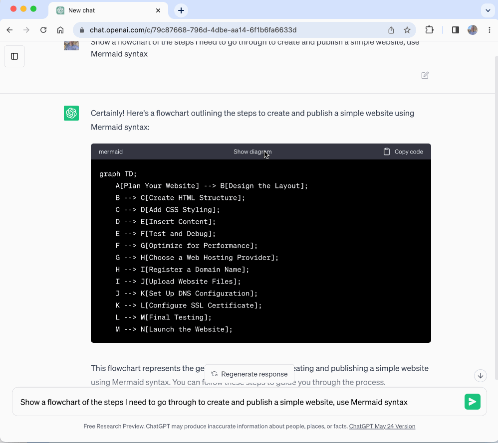

# A ChatGPT Extension to Create Diagrams

The [ChatGPT Diagrams](https://chrome.google.com/webstore/detail/chatgpt-diagrams/gllophmfnbdpgfnbmbndlihdlcgohcpn) browser extension makes it extremely easy to create diagrams with ChatGPT. In this article I'll show how to use the extension, and share some of the learnings from building it.


## How to create diagrams

To create diagrams, we just need to prompt ChatGPT to use [Mermaid Syntax](https://mermaid.js.org/). Mermaid is a text-based language that can be used to describe flowcharts, sequence diagrams, and many of types of diagram.

Here's what a few prompts could look like - not that in each one we request that the output uses Mermaid syntax:

- Show the basic building blocks of a chrome extension using mermaid syntax
- Show a flowchart of the steps I need to go through to create and publish a simple website, use Mermaid syntax
- What's the sequence diagram for publishing an app in the apple store? Use Mermaid Syntax.

And here's what each of the prompts would produce:

> Show the basic building blocks of a chrome extension using mermaid syntax


> Show a flowchart of the steps I need to go through to create and publish a simple website, use Mermaid syntax



> What's the sequence diagram for publishing an app in the apple store? Use Mermaid Syntax.


That's really all there is to it!

## Troubleshooting and common issues

This project is something I've put together quite quickly and there are still some rough edges. Some issues you might face:

**Mermaid Syntax Error**

This normally happens if you haven't told ChatGPT to use Mermaid Syntax. Try your prompt again but make sure to include the text "show output using Mermaid syntax".

**Diagrams are empty**

Try refreshing the page and then choose "Show Diagram".

## Building the Extension

The extension is available on GitHub at:

https://github.com/dwmkerr/chatgpt-diagrams-extension

Just clone, then run:

```bash
npm install
npm start
```

Open chrome at: `chrome://extensions`, choose "Load Unpacked" and select the `./dist` folder from your local copy of the `chatgpt-diagrams-extension` repository. Everything else you need to know should be on the [README](https://github.com/dwmkerr/chatgpt-diagrams-extension).
