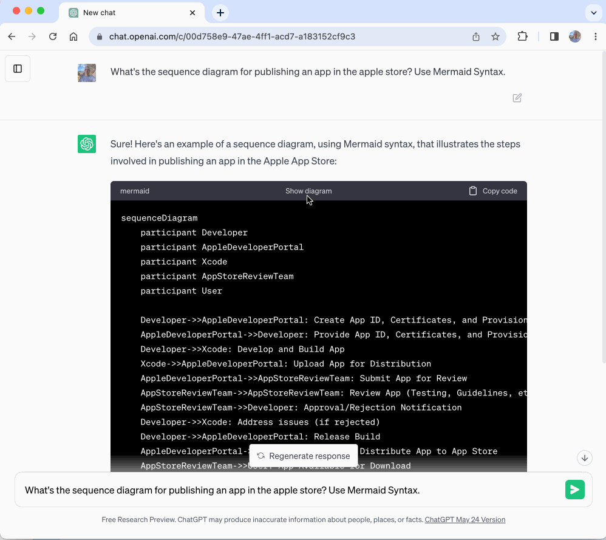
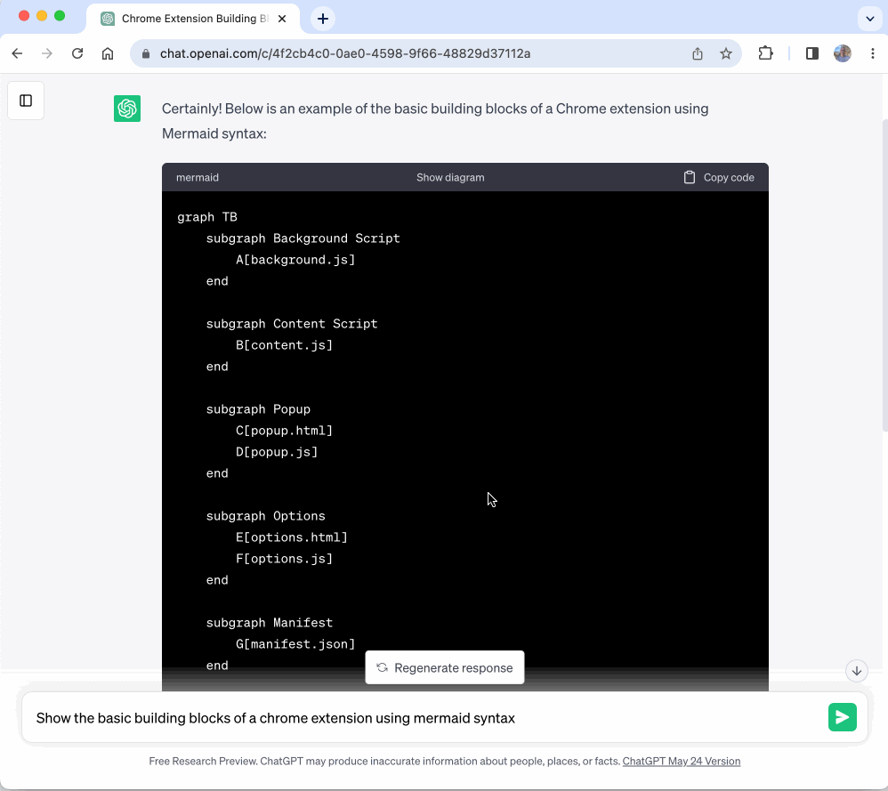
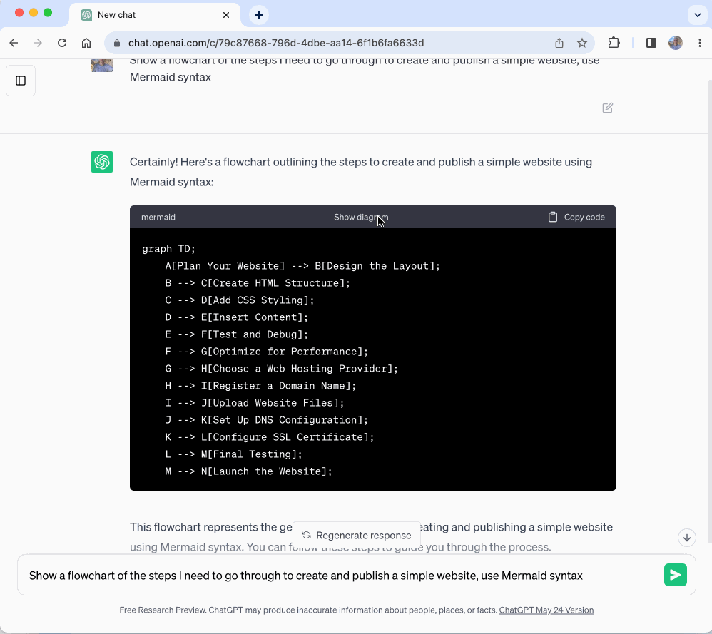

Quick Links: [ChatGPT Diagrams on the Chrome Web Store](https://chrome.google.com/webstore/detail/chatgpt-diagrams/gllophmfnbdpgfnbmbndlihdlcgohcpni) | [ChatGPT Diagrams on GitHub](https://github.com/dwmkerr/chatgpt-diagrams-extension)

The [ChatGPT Diagrams](https://chrome.google.com/webstore/detail/chatgpt-diagrams/gllophmfnbdpgfnbmbndlihdlcgohcpn) browser extension makes it extremely easy to create diagrams with ChatGPT. Here's how the extension looks in action:



## How to create diagrams

To create diagrams, just follow the steps below:

- Install the [ChatGPT Diagrams](https://chrome.google.com/webstore/detail/chatgpt-diagrams/gllophmfnbdpgfnbmbndlihdlcgohcpn) from the Chrome Web Store
- Enter a prompt asking to draw a diagram - and make sure you include the text "use mermaid syntax", for example: _Show the basic building blocks of a chrome extension using mermaid syntax_
- ChatGPT will output some code - press the "Show Diagram" button above the code block to render your diagram

That's it! We just need to prompt ChatGPT to use [Mermaid Syntax](https://mermaid.js.org/). Mermaid is a text-based language that can be used to describe flowcharts, sequence diagrams, and many of types of diagram.

The extension searches for code blocks that look like they could be Mermaid diagrams, and then adds a little "Show Diagram" button to each one - pressing this will then attempt to render the diagram using Mermaid. It is not 100% fool-proof, sometimes ChatGPT gets the syntax wrong, but generally works pretty reliably.

Here's what a few prompts could look like - not that in each one we request that the output uses Mermaid syntax:

- Show the basic building blocks of a chrome extension using mermaid syntax
- Show a flowchart of the steps I need to go through to create and publish a simple website, use Mermaid syntax
- What's the sequence diagram for publishing an app in the apple store? Use Mermaid Syntax.

And here's what each of the prompts would produce:

> Show the basic building blocks of a chrome extension using mermaid syntax



> Show a flowchart of the steps I need to go through to create and publish a simple website, use Mermaid syntax



> What's the sequence diagram for publishing an app in the apple store? Use Mermaid Syntax.


That's really all there is to it! Raise any suggestions or bugs on the [issues page](https://github.com/dwmkerr/chatgpt-diagrams-extension/issues) and if you find this extension useful please do [rate it or leave a review](https://chrome.google.com/webstore/detail/chatgpt-diagrams/gllophmfnbdpgfnbmbndlihdlcgohcpn)!

## Troubleshooting and common issues

This project is something I've put together quite quickly and there are still some rough edges. Some issues you might face:

**Mermaid Syntax Error**

This normally happens if you haven't told ChatGPT to use Mermaid Syntax. Try your prompt again but make sure to include the text "show output using Mermaid syntax".

**Diagrams are empty**

Try refreshing the page and then choose "Show Diagram".

## Building the Extension

The extension is available on GitHub at:

https://github.com/dwmkerr/chatgpt-diagrams-extension

Just clone, then run:

```bash
npm install
npm start
```

Open chrome at: `chrome://extensions`, choose "Load Unpacked" and select the `./dist` folder from your local copy of the `chatgpt-diagrams-extension` repository. Everything else you need to know should be on the [README](https://github.com/dwmkerr/chatgpt-diagrams-extension).

## Further Reading

- [Using ChatGPT to build System Diagrams](https://aruva.medium.com/using-chatgpt-to-build-system-diagrams-part-i-69efc7603926)
