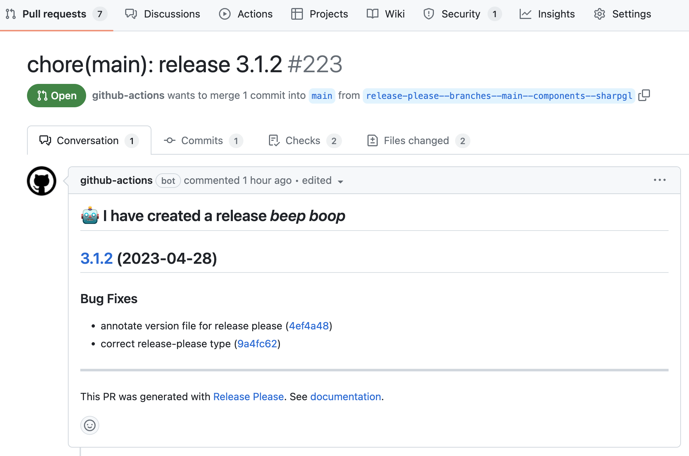
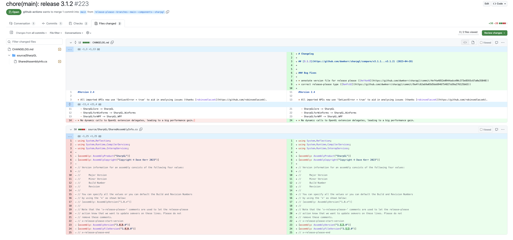

[Release Please](https://github.com/googleapis/release-please) is an excellent library from Google that simplifies the management of releases for projects. However, it is not immediately apparent from the Release Please documentation that you can very easily get this working for your .NET projects.

In this article we'll take a quick tour of how to configure release please for a .NET project and how it can save you time and effort.

## What is Release Please?

In a nutshell, Release Please is a tool that can be run as a CLI or a GitHub action, that looks over the commit history for a repository. Based on the commit history, the tool will attempt to identify whether there have been major, minor or patch level changes to the code, based on the [semantic versioning](https://semver.org/) spec and the usage of [Conventional Commits](https://www.conventionalcommits.org/en/v1.0.0/). It will then open a pull request that updates the changelog for your project and sets a new version number, and allows you to then easily run custom release actions if the pull request is merged.

This is easier to see with a few screenshots. I recently added Release Please to my [SharpGL](https://github.com/dwmkerr/SharpGL) project. After making a change, I get a pull request like this:



Going into the details of the pull request, what is particularly useful is that my changelog has been updated, as well as the version data in my `SharedAssemblyInfo.cs` file:



## How does this help?

If you maintain a lot of open source projects, anything you can do to automate chores like this just brings rigour to the process and makes bringing in contributions far easier.

A bug had been raised on the repo:

https://github.com/dwmkerr/sharpgl/issues/220

This bug indicated that the published version on NuGet was mis-aligned with the version in the source code. This is obviously a real problem for consumers of the library as well as contributors.

I use Release Please for most of my projects now, I particularly like having the release pull request to review, it makes it really easy to see what'll be in the next published vesrion.

## How do you configure Release Please for .NET?

It turns out that this is really easy! You can configure you manifest like so:

```json
{
    "release-type": "simple",
    "package-name": "sharpgl",
    "extra-files": [
        "SharpGL/AssemblyInfo.cs"
    ]
}
```

Or directly in your GitHub pipeline configuration:

```yaml
name: main
on:
  push:
    branches:
      - main
jobs:
  main:
    runs-on: ubuntu-20.04
    steps:
      - uses: google-github-actions/release-please-action@v3
        id: release
        with:
          token: ${{ secrets.GITHUB_TOKEN }}
          release-type: simple
          package-name: sharpgl
          extra-files: |
            SharpGL/AssemblyInfo.cs
```

It is not immediately apparent from the Release Please documentation that you can manage version numbers in a C# file, but the after looking at the [Customising Guide](https://github.com/googleapis/release-please/blob/main/docs/customizing.md#updating-arbitrary-files), it turns out there is a 'generic' file updater that simply looks for version numbers, based on regexes, in any arbitrary files. You just need to use some comments to show where these version numbers are. In my case, the code looks like this:

```cs
using System.Reflection;
using System.Runtime.CompilerServices;
using System.Runtime.InteropServices;

[assembly: AssemblyProduct("SharpGL")]
[assembly: AssemblyCopyright("Copyright © Dave Kerr 2023")]

// x-release-please-start-version
[assembly: AssemblyVersion("3.0.0.0")]
[assembly: AssemblyFileVersion("3.0.0.0")]
// x-release-please-end
```

Adding these `x-release-please` comments is enough for Release Please to be able to identify the lines that need to be updated.

## Other Improvements

There are two immediate improvements that you can make on top of these changes to make it even easier to handle releases.

### Commit Linting

The first improvement is to look at something like [`commitlint`](https://github.com/conventional-changelog/commitlint) to ensure that incoming pull requests have commits that meet the conventional commit spec. For Release Please to be able to properly infer the types of changes from the commit history, it is essential that [conventional commits](https://www.conventionalcommits.org/en/v1.0.0/) are used.

Remember - even with a hook to check commit messages, you'll need need to confirm that the author of the changes has structured the commit message appropriately, such as correctly identifying breaking changes.

### Automated Publishing

It is possible to update your build pipeline to actually publish your packages when the release pull request is merged. Here's an example for a .NET project:

```yaml
# The 'main' workflow is used to create the 'Release Please' pull
# request. This PR is opened when we have a new commit to main.
# See:
#   https://github.com/googleapis/release-please
name: main
on:
  push:
    branches:
      - main
jobs:
  main:
    runs-on: windows-2022

    steps:
    - name: Checkout
      uses: actions/checkout@v3

    # Note - this is where you put your build / test steps. See:
    # https://github.com/dwmkerr/sharpgl/blob/main/.github/workflows/main.yaml
    # For an example.

    # Now that we know the build runs, create a release PR if needed.
    - uses: google-github-actions/release-please-action@v3
      id: release
      with:
        token: ${{ secrets.GITHUB_TOKEN }}
        release-type: simple
        package-name: sharpgl
        extra-files: |
          source/SharpGL/SharedAssemblyInfo.cs

    # If we are building a release (i.e. we've merged from release-please) then
    # we can deploy.
    - name: Publish
      run: dotnet nuget push ./source/SharpGL/artifacts/packages/*.nupkg --source 'https://api.nuget.org/v3/index.json' --api-key ${{secrets.NUGET_API_KEY}}
      shell: bash # bash for globs in commmand above...
      if: ${{ steps.release.outputs.release_created }}
```

## Summary

I'd highly recommend this approach for .NET projects. Adopting semver and conventional commits should make managing contributions and your changelog easier. Release Please really is the icing on the cake - by having structured commits with strong semantics you can reduce overhead and effort and increase automation.

I have not included much on enforcing conventional commits in the repository or this article at the moment, some of the best tooling for this uses the Node stack (Husky and commitlint specifically). The benefits of enforcing conventional commits may well be worth the extra effort of setting these tools up, it's really up to you to decide.
