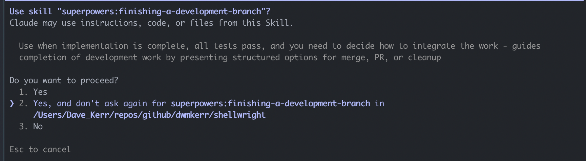

In this article I'm going to show some popular agentic development workflows in action.

I've referred to these as 'protocols' - some kind of combination of tools, subagents, scripts, skills and commands that enable you to follow a workflow or apply a particular methodology. Using a protocol for software development will generally give more predictable results, (greatly) increase velocity and help you put time and effort into the right place - which is typically good planning rather than iterating on code.

Almost all of these patterns anchor around clarifying the user's "intent", then documenting that in the repo. From this a specification and then plan is built, reviewed, and the agents then work on the implementation. Some of these protocols are quick and easy to try out, some are more complex and opinionated.

I'll update this article periodically with a real-world demonstration of some of the popular protocols that are out there. But to get started, we'll take a look at **Superpowers**.

## Obra Superpowers

[Superpowers](https://github.com/obra/superpowers) is a very popular (+50K stars at time of writing) framework for agentic software development.

Superpowers takes you through a common sense flow for software development, essentially:

- Brainstorm, clarify intent, challenge assumptions
- Document the goals, build a plan, create a design
- Create an isolated environment / worktree to work in
- Execute the plan, following TDD methodologies
- Review the results and integrate

This is handled with a combination of slash-commands, sub-agents and skills. Superpowers is a good place to start because it's quick and easy to set up and play with. It's less sophisticated than other protocols, but almost all protocols follow a similar pattern (build a spec, then a plan, implement it, and attack and challenge along the way).

As a demonstration, I'll use my [Shellwright](https://github.com/dwmkerr/shellwright) project. Shellwright lets an LLM run a terminal and record what's going on (a bit like [Playwright](https://playwright.dev/) browser automation but for the shell). I can ask my agent to record an action in the shell and get a video of the result (this recording shows the agent opening and closing Vim):

[](./superpowers/shellwright-before.gif)

My new requirement is simple - I need to be able to optionally include the terminal cursor in the recording and screenshots.

This is a small simple change that with good instructions and a sensible implementation protocol we should be able to knock out fast. We could just prompt for it, but a protocol like Superpowers will help make the process more structured.

### Brainstorming

You start using Superpowers by **brainstorming**. Use the `/superpowers:brainstorm` slash command and describe what you want:

> /superpowers:brainstorm I want to be able to optionally show the cursor in Shellwright recordings or screenshots

Permissions are requested, the codebase is explored, clarification is requested:

[](./superpowers/01-brainstorm-clarify.png)

In this example, the brainstorm process actually changed the design considerably. Rather than my initial idea of a parameter to show or hide the cursor, the recommendation was to just respect the state of the in-memory terminal.

This means in most cases there'll be a cursor, it's only certain programs such as Vim that hide it at certain times. We don't need to let the caller choose to turn it on or off, the terminal does that itself.

This was a good suggestion, it follows the [principle of least astonishment](https://github.com/dwmkerr/hacker-laws?tab=readme-ov-file#the-principle-of-least-astonishment). It keeps my API clean, and I can always make things more configurable in the future if I need to. Being challenged is essential, it's one of the best things about working with other experienced engineers, and LLMs don't tend to do it unless really instructed to do so.

Approaches are now suggested, with trade-offs:

[](./superpowers/01-brainstorm-approaches.png)

I chose the approach that keeps the main flow as-is and adds a separate pass for the cursor rendering, which feels like a good separation of concerns as well as a little less risky.

There was a bit more discussion around design, all common sense stuff. Finally a plan is written. You can see it in the pull request in [`docs/plans/2026-02-13-cursor-visibility-design.md`](https://github.com/dwmkerr/shellwright/pull/57/changes#diff-729c3aa4f78f8d87f05ffa8a4cb6ff96ee82bb5872fc1526bc7ecbae1e987c52).

Superpowers does a decent amount of exploration using subagents and uses specific planning skills to build the plan. The structure of the plan is less rigorous or prescriptive than some other protocols but it's also pretty easy to follow.

This structured planning approach is essential, almost every protocol I use spends a lot of time building plans and specs (except for protocols that are more around exploration and experimentation, which is really just to build data for a plan later on).

**An early mistake**

Interestingly here's where superpowers (or to be fair, the LLM) struggled. An assumption had been made that the underlying terminal emulator (xterm.js) actually allowed you to check cursor visibility. When moving into the design the agent quickly decided that there is no visibility field exposed in the in the xterm API, and then suggested just always showing the cursor.

LLMs can be weirdly defeatist sometimes. I kicked off my own [`researcher`](https://github.com/dwmkerr/claude-toolkit?tab=readme-ov-file#researcher) agent and asked it to investigate (this agent clones repos, looks into code, uses a headless browser if needed to read docs, asks for content it can't find and so on, and tries to find at least 2-3 data points to corroborate findings).

It quickly found that the API _is_ exposed, backed up by three data points (docs on the API, a unit test for it, and a GitHub issue that discusses it). The research output is at [`./docs/plans/research`](https://github.com/dwmkerr/shellwright/blob/main/docs/plans/research/cursor-visibility-detection.md)

Anyway, Superpowers had asked me to review the plan, so I saw the issue and made the correction (tracking the research results as well for future reference).

### Implementation

Once the plan is approved, we move to execution. Two modes are offered - subagent driven, which iterates on each task via subagents in the current session with review at each step, or a parallel session (which is where you kick off a completely new process and execute from there).

[](./superpowers/02-execution-modes.png)

In this case I chose to run a new session as I didn't expect to have to do any more orchestration from my main session:

```bash
claude '/superpowers:executing-plans docs/plans/2026-02-13-cursor-visibility.md'
```

Additional skills are run to make sure we have a working location - Superpowers asks where we want to keep our Git worktree[^1]. This is a really nice feature, I had something similar in one of my own protocols (creating a `.sandboxes` folder) but Superpowers is explicit with what is going on:

[](./superpowers/02-execution-worktree.png)

This skill also checks to see whether `.worktrees/` is git-ignored and suggests to ignore it if it isn't.

**The half-time mistake**

Halfway through implementation, the agent got confused and couldn't find the visibility field mentioned in the plan. It then decided the best approach was to just always show the cursor. I was watching so that I could grab screenshots and take notes so quickly saw the mistake.

At this point I was reminded of something from my [favourite CLAUDE.md file](https://gist.github.com/ctoth/d8e629209ff1d9748185b9830fa4e79f#notice-confusion):

> **Notice Confusion**
> 
> Your strength as a reasoning system is being more confused by fiction than by reality.
> When something surprises you, that's not noise—the universe is telling you your model is wrong in a specific way.
> - Stop. Don't push past it.
> - Identify: What did you believe that turned out false?
> - Log it: "I assumed X, but actually Y. My model of Z was wrong."
> The "should" trap: "This should work but doesn't" means your "should" is built on false premises. The map doesn't match territory. Don't debug reality—debug your map.

The author is clearly very experienced with the implicit biases in these tools. 

I challenged the LLM to discover why the research had three data points saying the visibility field existed, but the local library seemed to not. After a few nudges it worked out that the field was added in a more recent version of the library and we needed an upgrade.

### Review

The next stage is to review the implementation and test. 

**Late game wobble**

Superpowers' test plan in this case was 'manual verification' - not even a single unit test. I was very surprised, it'll normally create failing tests first and then show them passing, following TDD patterns. The red/green approach is great for challenging assumptions early.

Why testing was not part of the plan I don't know. Shellwright has few unit tests, and a fairly complex evaluation pattern. Perhaps this caused confusion.

To be fair, testing Shellwright properly is quite hard. I use unit tests, but an end to end test means giving an LLM access to the MCP server, asking it to issue commands and record videos. Deterministically verifying these is hard (for various reasons that are described in the project).

To handle more complex testing scenarios, I have prompts stored in markdown files. These are instructions that are passed during CI/CD to an agent that has the Shellwright MCP server installed. Each prompt produces a video, and I show a table in the pull request with the "before" and "after" for each scenario. This means I can eyeball how the videos look and get a sanity check that output is looking sensible. A table like this is added to pull requests:

[](./superpowers/shellwright-evals.png)

I've opened a PR here that I'll keep open so you can see it - check the "View Recordings Evalution" section:

https://github.com/dwmkerr/shellwright/pull/60

Superpowers didn't notice any of my (fairly well documented) evaluation approaches. However, when I instructed it to RTFM it went ahead and created a new reference video. Here it is - a shell recording showing the `Ctrl+A` shortcut that moves the cursor to the beginning of the line:

[](./superpowers/01-execution-evaluation.gif)

Instructing the LLM to follow my evaluation patterns was the final intervention I needed to make.

### Finishing Development

Superpowers moves into the 'finishing' stage at this point:

[](./superpowers/03-finishing.png)

This is when tests are re-run, the build is checked again, there's a final verification of the work and so on. The final PR is below:

https://github.com/dwmkerr/shellwright/pull/57

It's adequate. I was surprised to not get challenged on unit tests on this one, normally superpowers does a better job. A quick look at the evaluation records that are produced shows what I'd expect - old recordings don't have a cursor, new ones do:

[](./superpowers/04-pr-summary.png)

The code changes are small. No documentation changes have been made (and that's probably OK).

### Thoughts on Superpowers

I feel I might have given Superpowers a slightly rough ride, for whatever reason, maybe because I decided to use this particular task for the write up, it wasn't as smooth as other times.

But in reality, Superpowers is great. It takes almost no setup, is not particularly opinionated and follows common sense patterns. If you want a gentle introduction to orchestration protocols its a great place to start. It's easy to change later and the foundational concepts you'll see in many other protocols.

Some of my projects have more opinionated processes, many are more spec-driven, some I'm still experimenting with, some are more team orientated. But if I'm just jumping into something new, or looking at an issue in another project, I'll often use Superpowers at first and then pivot if it struggles. Used well it can handle far far more complex tasks than I demoed here.

This brief whirlwind tour got a little convoluted. Things worth noting:

**Major version changes**

This 'small' change required a bump from v5 to v6 of xterm-js. The model / agent / protocol didn't warn at any stage that this is risky or should at least be considered with caution. This is the sort of thing I call a 'signal' - something in a change that might indicate more attention is needed.

**Protocols are not rules**

Superpowers normally red/greens tests (i.e. creates failing tests to show that the desired behaviour is not present, then makes changes, then shows that the tests now pass), which is excellent - TDD is a great pattern. But even well encoded protocols are not rules, we still rely on the LLM to follow these instructions.

It is still surprising how quickly models can stray away from instructions.

You can get some enforcement by using hooks (and some of the other protocols I'll describe do this), but it is safest to assume the model will stray from time to time.

**Evaluations and test harnesses are important**

My intent was a small, common sense change to the output of my project. But it required a major version upgrade of an essential library, as well as change to the main rendering functionality.

This project is hard to test in a completely deterministic fashion. I feel that the effort put into being able to see videos side-by-side of before and after changes is hugely beneficial. I probably spend more time nowadays building 'the machine' (such as the evaluation system, the automated testing) than the code, and that's a good way to go.

Anything that provides evidence of correctness is essential if we want to be able to make changes quickly.

**LLMs hallucinate, make assumptions, and mistakes compound**

There were a few pretty glaring mistakes:

1. During planning, the name of a parameter was hallucinated
2. During implementation, when the parameter couldn't be found, an assumption that no such parameter existed was made
3. During implementation, confusion (research saying a parameter existed, code saying it didn't) was not escalated - instead, assumptions were made

Each mistake required intervention. Superpowers (and similar protocols) are filled with instructions to avoid bias, instruct agents to stop when confused, don't make assumptions, and so on, but it still happens. It's in the nature of the technology - completions models are designed to helpfully complete your request.

Practice and experience helps here. As soon as something seems weird, I'll often kick off research agents. They run independently and are instructed to gather evidence - find code, find issues, find websites, cite sources. Identifying signals (things that seem intuitively wrong, or that might be consequential, risky, and so on) is important.

### Try it out

Give Superpowers a whirl. Its quick to install and it interactively guides you through the process and protocol.

```bash
claude plugin marketplace add obra/superpowers-marketplace
claude plugin install superpowers@superpowers-marketplace
claude "/superpowers:brainstorm I want to build an agentic SLDC protocol"
```

Any thoughts or feedback welcome. I'll be doing a tour of OpenSpec next (or maybe Ralph, depending on time/feedback).

[^1]: I find worktrees really janky, mostly because you can't have the same branch open in multiple worktrees. In my flow I have my repos structured in folders like: `~/repos/github/org/project/[branchname]` and just do a full-fat checkout (and a tmux tab per branch). Its heavier on the filesystem but you have freedom to switch branches at will (and can open a tmux session with a tab for each branch you are working on with a single command).
