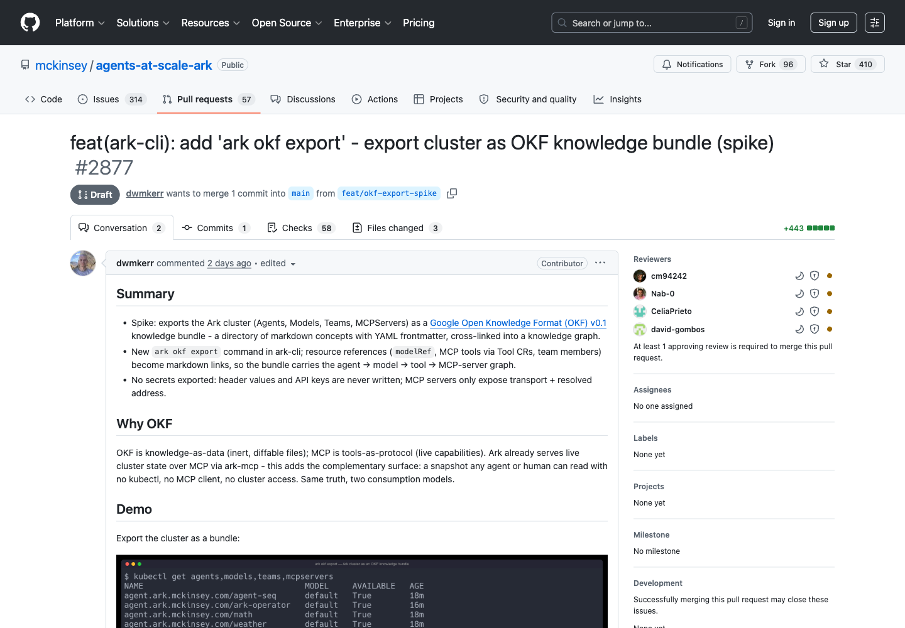
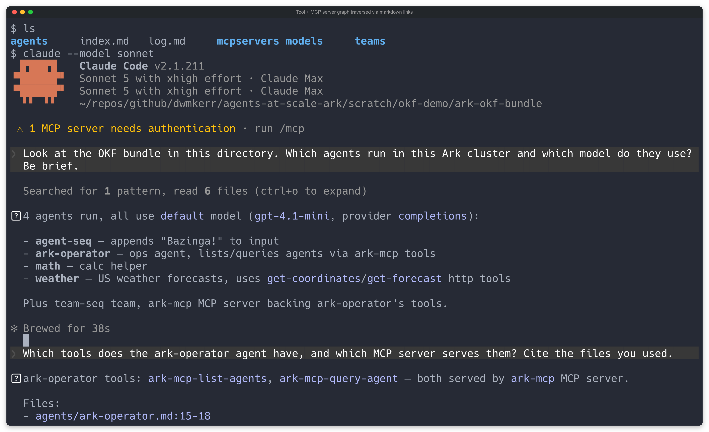

One of the most useful things I have found for agents when developing software is _gathering evidence_. Specifically, when changes are proposed to some kind of system (lets say for example via a pull request), that as much evidence of correctness is gathered as possible.

As an example, this is a pull request for a spike that shows how to integrate [OKF](https://github.com/GoogleCloudPlatform/knowledge-catalog/blob/main/okf/SPEC.md) exports into [Ark](https://github.com/mckinsey/agents-at-scale-ark). The specific details of this change are not important, what is important is that it will change the CLI in a fairly specific way. Previously, I would normally have asked whoever worked on this to record some screenshots - it at least lets me eyeball how it looks. With agentic, we can add a tonne of this with little effort:

This pull request has the changes, but also a lot of _evidence_ attached - not just unit test results or coverage (which is simply hygiene), but also screenshots of what the new CLI looks like, and even recordings.

The whole pull request - and all of this evidence - was created async with a single run of Claude Code with Fable.

## Why Evidence

Essentially - skip the code or spec review until you can see what the output is like. This is the smell-test, if it looks directionally correct, then you continue with the more formal review process. This is increasingly important as features end-to-end are built without supervision.

The most valuable forms of evidence include:

1. Links to ephemerally provisioned environments where you can actually see and interact with what has been built
2. Screenshots of user interfaces showing before / after
3. Video recordings of user interfaces (even better than the above)
4. Screenshots / recordings of terminal interfaces
5. Recordings of other types of channel interface - for example, mobile emulator recordings (for checking what things'll look like on iOS or Android)

What does this mean in practice and what should your team do?

## What you should do differently

Pretty simple - invest the time in building evidence gathering machinery. It pays compound interest, and allows you to avoid reviewing something that doesn't look right. Spend more time on the machinery around the pipeline rather than the specific features themselves (or at least balance it).

## A ready-to-go tool for your tooling - terminal recordings

[Shellwright](https://github.com/dwmkerr/shellwright) is Playwright for the shell: an MCP server giving agents a real PTY to type into, screenshot, and record as GIFs. I use this all the time for projects with CLIs, and specifically built it so that agents can provide evidence of changes such as recordings before and after.

Recap of the example in the opening: an agent built [`ark okf export`](https://github.com/dwmkerr/agents-at-scale-ark/pull/186) overnight - a command that exports a Kubernetes cluster's agent configuration as markdown files ([Google's Open Knowledge Format](https://github.com/GoogleCloudPlatform/knowledge-catalog/blob/main/okf/SPEC.md)). Tests passed. But the real claim was "any agent can now read your cluster from plain files, no cluster access" - so the agent recorded a live Claude Code session in the exported directory, driven through Shellwright:

The key screenshot - the answer cites the files and line numbers it read:

That one image did more for my review than the test suite: the files are readable, the links work, the premise holds.

## Improving the machinery

The first recording had a flaw - the answer appeared only in the GIF's final frame, a fraction of a second. I said "I don't see Claude reading though?" and the agent re-recorded. A real review finding, from a recording, in seconds.

The fixes fed back into the tooling: a `hold_last_ms` option so GIF endings don't flash past, and a `shell_wait_for` tool for the "is the TUI still busy?" problem ([PR here](https://github.com/dwmkerr/shellwright/pull/79)). The machinery improves.

## That's it

This doesn't replace tests or reading the code - it sequences the review. See it work, check it's the right thing, then read the diff.

The spike PR is [here](https://github.com/dwmkerr/agents-at-scale-ark/pull/186), the Shellwright improvements [here](https://github.com/dwmkerr/shellwright/pull/79).
