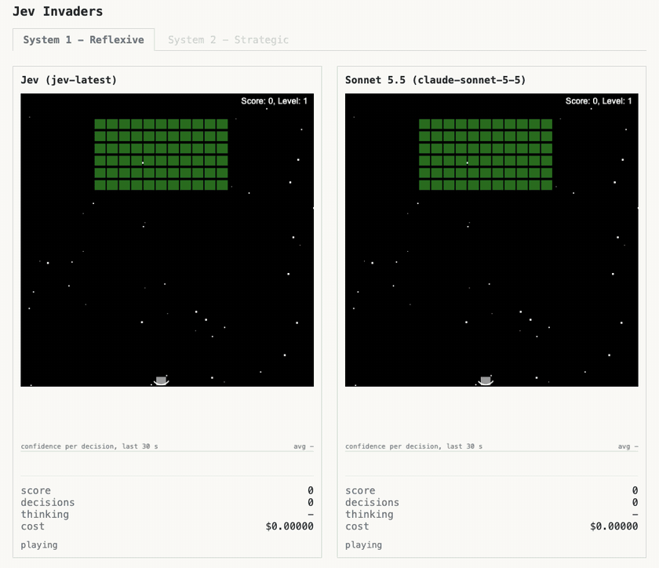
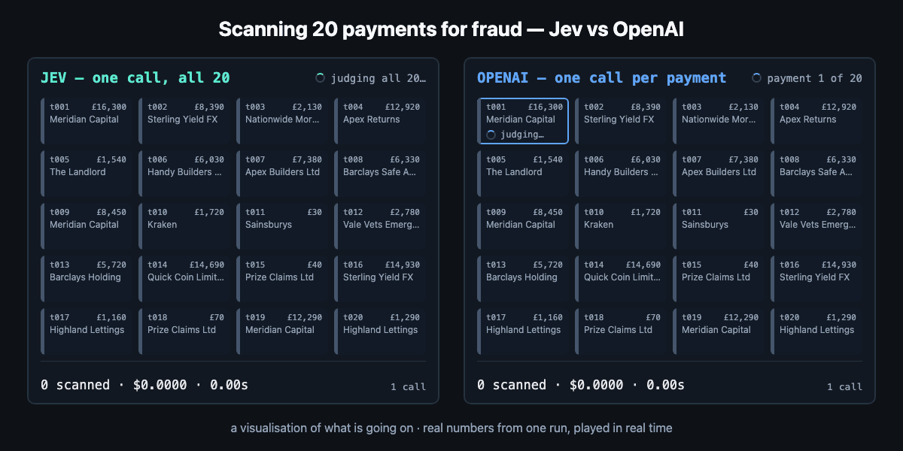

I've been travelling in the mountains for a couple of weeks. Being disconnected from technology while in the hills has been lovely but there was one topic in particular I was itching to get my hands into and do a short non-tech and tech overview on, which is Jev and System 1 models.

Typesafe AI[^typesafe] released a new type of model called "Jev" which they described as a "System 1 model" (others have been describing it as a "Decision Model"[^naming]) - there has been a lot of excitement and hype.

I really recommend reading their [Release Announcement](https://typesafe.ai/blog/introducing-system-one-models-and-jev) - and then if it doesn't entirely make sense then please read on. I'll try and explain what it means, whether you should care, show a fun example of a decision models playing Space Invaders very quickly (then a regular LLM playing a game more strategically) and then a potentially more serious example of using a decision model to quickly check for potential fraud (at moderately high frequency).

As a delightful hook, enjoy the gif below of Jev vs Sonnet in gaming, and Jev quickly making judgements on fraud (both will be discussed).





Hopefully by the end of this article you can re-read the launch announcement and it might make more sense.

## Refresher - Completion Models

First a brief review of what a regular large-language completion model like ChatGPT is. LLMs are trained on vast amounts of data and essentially encode the semantics of language. The training data includes huge amount of human knowledge and opinion (think the beauty of wikipedia and the horror of some social media). They are very good at modeling patterns in language and can give very compelling answers to complex questions.

There's an interactive visual that is super simplified on how an LLM works that I published here:

[](https://dwmkerr.github.io/llms-visualised/)

*Words and concepts positioned by meaning - a frame from my interactive guide, [LLMs Visualised](https://github.com/dwmkerr/llms-visualised).*

Given input, an LLM provides the most statistically likely response based on how it is trained:

```text
Input: What is the capital of France?
Output: Paris
```

These are completion models - they complete text. Conversational models have been further trained to answer in a conversational format (this is where the 'Chat' in 'ChatGPT' comes from):

```text
Input: What is the capital of France?
Output: Paris - a beautiful and famous city. What would you like to know about Paris - are you visiting, should I build you an itinerary? Or just curious?
```

Training models takes vast amount of data and compute and is hugely expensive. Running them is expensive, so model providers charge based on the size of input and the amount of output. Output is normally more expensive. Better quality models are more expensive, faster output is usually more expensive and there are a raft of options to choose from - frontier labs, smaller labs, open weights, self-hosted, and so on.

## Decision Models vs Completion Models

A 'decision model' does not complete text. You hand it some state (context or information) and one or more typed questions, and for each it gives an answer or judgement in the form of:

- a noul - the probability, from 0 to 1, that a statement is true
- a choice - one option from a set you define (with a confidence score on each option)
- a score - a position on a scale you define, again with probabilities and a confidence.

Here's a trivial example:

**Input**

```json
{
  "state": "The capital of France is Paris.",
  "model": "jev-latest",
  "questions": {
    "is_true": { "type": "noul", "instructions": "Is this statement true?" }
  }
}
```

**Output**

```json
{
  "answers": {
    "is_true": { "type": "noul", "noul": 0.99 }
  }
}
```

Based on how the model was trained, and the input you provided, the judgement is '99% likely to be a true statement'.

Here are a couple more. Scoring how opinionated a piece of text is (a `score`, a position on a scale you define, with a probability for each level):


```json
{
  "state": "This laptop is overpriced garbage and only a fool would buy it.",
  "model": "jev-latest",
  "questions": {
    "opinion": {
      "type": "score",
      "instructions": "How opinionated is this text?",
      "criteria": ["Neutral fact", "Mixed", "Strong opinion"]
    }
  }
}
```
<!--out-->
```json
{
  "answers": {
    "opinion": {
      "type": "score",
      "score": 1.9,
      "legend": { "0": "Neutral fact", "1": "Mixed", "2": "Strong opinion" },
      "probabilities": { "0": 0.0, "1": 0.1, "2": 0.9 },
      "confidence": 0.94
    }
  }
}
```


Or judging an action against a set of rules (a `choice`, one option from a set, with a probability for every option plus an overall confidence, which is quite similar to a score except that a single specific value from the set is chosen):


```json
{
  "state": {
    "regulations": "<all compliance policies for the business>",
    "action": "Offer to connect the user with fellow investors"
  },
  "model": "jev-latest",
  "questions": {
    "verdict": {
      "type": "choice",
      "instructions": "Given the regulations, how risky is this action?",
      "criteria": {
        "compliant": "Clearly allowed",
        "needs_review": "Ambiguous - a human should check",
        "prohibited": "Likely breaches the rules"
      }
    }
  }
}
```
<!--out-->
```json
{
  "answers": {
    "verdict": {
      "type": "choice",
      "choice": "prohibited",
      "probabilities": { "compliant": 0.04, "needs_review": 0.15, "prohibited": 0.81 },
      "confidence": 0.9
    }
  }
}
```


Here the model is confident it's a problem - quietly connecting one customer to others leaks their personal data, a clear privacy breach - so it returns `prohibited` at high confidence and your code can simply block it. A genuinely borderline action would instead come back with a *low* confidence spread across the options, which is your cue to route it to a human rather than pretend certainty.

The important note is that the output is _free_ and comes back very quickly[^pricing].

## Fun example - System 1 models playing Space Invaders fast vs System 2 models playing strategically


13 years ago I built my own version of the "Space Invaders" game whilst learning JavaScript (my mind boggles at the changes since then). A fun use case can be made of this - give the state of the game to Jev and ask it to decide on the best action (move / fire). As Jev is low latency it should come back very quickly and play real-time[^classicml]. An LLM like Sonnet will need a bit more massaging and will take longer (as we're using a complex model that can use reasoning to answer a more simple question, essentially over-gunning it).

We can also make a game that is more suited to a model like Sonnet - in connect four there is more strategy and longer term planning involved, so an LLM with reasoning should be able to out-play a simple decision model.


The source is in the original [Space Invaders](https://github.com/dwmkerr/spaceinvaders) repo. You can play the OG 13 year old one or clone it and run the System 1/2 version locally with your own keys. This is a fun example to play with and shows the rough idea.

## A more serious example - rapid judgements on potential fraud


In this example we give the decision model a rolling window of recent scam signals (company names, or text associated with fraud) as shared context, then (in a single call) ask one question per transaction whether each of a batch is safe, low-risk or high-risk, with a confidence. An application on top of this could fire a popup asking for confirmation for low-risk cases or block high risk cases[^injection].


```json
{
  "state": {
    "todays_scam_patterns": [
      "'safe account' scam: caller poses as the bank, urges moving funds",
      "private car sale: urgent same-day payment to a brand-new payee"
    ],
    "flagged_payees_24h": ["QuickCoin Ltd", "J. Marku"]
  },
  "model": "jev-latest",
  "questions": {
    "txn_1": {
      "type": "choice",
      "instructions": "£14,900 to 'Quick Coin Limited', new payee, 3x normal limit, 23:40. Reason given: 'buying a car from a private seller'.",
      "criteria": { "safe": "...", "low": "...", "high": "..." }
    },
    "txn_2": {
      "type": "choice",
      "instructions": "£42 to 'Tesco', a regular payee. Reason given: 'weekly shop'.",
      "criteria": { "safe": "...", "low": "...", "high": "..." }
    }
    // ... one more question per transaction, up to a full batch
  }
}
```
<!--out-->
```json
{
  "answers": {
    "txn_1": {
      "type": "choice", "choice": "high",
      "probabilities": { "safe": 0.05, "low": 0.15, "high": 0.80 },
      "confidence": 0.83
    },
    "txn_2": {
      "type": "choice", "choice": "safe",
      "probabilities": { "safe": 0.97, "low": 0.03, "high": 0.0 },
      "confidence": 0.95
    }
  }
}
```


The nice thing here is that we _batch_. The state (the scam data) is read *once* and every transaction-question runs against it in parallel - what TypeSafe call **fan-out**[^fanout]. We still get the benefit of semantics[^weakspots] - an exact blocklist would miss "Quick Coin Limited" (yesterday's flagged payee was "QuickCoin Ltd"), but the fuzzy semantic match - a near-miss name plus a narrative that resembles today's car-sale scam - still fires. That is the bit a decision model adds over rules, and it is much harder for a regular LLM to do at this speed and price[^whynotllm].

So I ran it - twenty transactions through Jev and four frontier models, scored against known labels (the little harness is in [`sample/`](https://github.com/dwmkerr/dwmkerr.com/tree/main/sample)):

| Model | Accuracy | Cost | Time | Calls |
|---|---|---|---|---|
| **Jev** | 100% | **$0.0001** | **0.4s** | **1** |
| Sonnet | 85% | $0.01 | 33s | 20 |
| Luna (GPT-6) | 100% | $0.0008 | 40s | 20 |
| Astra (GPT-6) | 100% | $0.05 | 52s | 20 |
| Opus | 100% | $0.04 | 81s | 20 |

The accuracy is much of a muchness on twenty fairly clear cases - don't read too much into that column. The gap that matters is the other three: Jev judged the whole batch in **one** call, in under half a second, for a fraction of a penny; each LLM made twenty calls and took the best part of a minute. The frontier models are also *forced* to reason - you cannot turn it off - which is exactly why they are slow and dear for a job this small.

## As an executive or technologist, should you care

Yes - it is useful to understand at least at a (very) high level what the fuss is about, partly to just separate out the noise (everyone who is releasing something new wants to show it as groundbreaking). The reality is that this might be a new class of very powerful types of models.

Whether this is novel is arguable - without knowing the internals it is possible that simply taking an open weights model and doing the same thing via prompt engineering is also 'good enough' or whether a model post-trained on your own data would in fact be better - but there are a nearly infinite number of use cases we can imagine and many may be served well by this technology[^novelty].

And it is moving fast. Jev landed on 15 September; within two weeks Together AI, Upstage and Liquid AI had shipped their own decision models, a clutch of open-weight clones appeared, and on 29 September OpenAI put its weight behind the shape with a Decisions API - though that one is a *constrained* frontier model (GPT-6 Luna with its output fenced to your options) rather than a purpose-built decision model like Jev[^category]. The open question is whether these general-model routers can match a dedicated model on cost and calibration - and prompt injection remains an unsolved caveat for all of them.

Possibly as an exec you might ask someone in your tech team to look at this, run a couple of experiments in your own domain, and share their learnings to your leadership team. More contextualised will be far more interesting and their real-world experience will be great to see (and probably a fun experiment for them to run).

That's the high level view - my post travel backlog is quite large so this is a short one but I hope you found it at least mildly interesting. No tokens were harmed during the writing of the text, but I have used AI to check references, spellcheck / grab screenshots from my other projects and so on.

[^typesafe]: TypeSafe AI, a San Francisco startup founded by former OpenAI researcher Diogo Almeida, came out of stealth on 15 September 2026 with a $40M seed round led by DCVC.

[^naming]: "System One" is a nod to Kahneman's *Thinking, Fast and Slow* - the fast, automatic mode of thought, as against the slow, deliberate "System Two" (a fair description of a reasoning LLM). Simon Willison prefers "decision model", a name he credits to Maggie Appleton: [Jev introduces a new shape of LLM](https://simonwillison.net/2026/Sep/21/jev/). Worth noting Jev is one product and others are already appearing, so the terms aren't truly synonymous.

[^pricing]: TypeSafe's own figures: input at $0.042 per million tokens, output "too cheap to meter", end-to-end latency of 70-500ms, and 40-200x faster than a frontier LLM on these "System One shaped" queries. So indeed, comparatively very cheap and fast.

[^whynotllm]: You *can* coax a number out of a normal LLM - `Answer with a single number between 0 and 1 only, where 0 is 0% and 1 is 100%` - but you pay for the generated tokens and the latency, and the number tends to be poorly calibrated. The genuinely new part of Jev isn't "a model that emits a number" - it's *calibration*: TypeSafe train with a method they call Reinforcement Learning for Calibrated Decisions so that (they claim) a stated confidence matches real accuracy, faster and cheaper than an LLM. Take it with a pinch of salt - they concede their own hallucination figure is "not empirical", and what is actually guaranteed is only that the output matches the requested schema (a 0% *type*-error rate), not that it is right.

[^fanout]: TypeSafe call this "speculative fan-out" - one state, many questions, all evaluated in parallel against the state read once. They report roughly 12x cheaper and 10x faster for 13 questions in a single call versus 13 separate calls. The state plus all questions must fit a ~64k-token budget, and there is no prefix/input caching - so batching, rather than one call per transaction re-sending the window, is what keeps it cheap.

[^injection]: This is exactly the pattern security researchers broke. A typed output constrains the *format* of the answer, not the *credibility* of the input - so you can slip fabricated evidence into the documents and flip the verdict. Check Point manipulated Jev's decisions roughly 59% of the time, at about $0.50 a go, with no reasoning trace for the analyst to spot: ["Jev Is Not a Language Model, but It Breaks Like One"](https://blog.checkpoint.com/ai-security/jev-is-not-a-language-model-but-it-breaks-like-one-prompt-injection-against-a-typed-decision-model/). If you use it as a gate, screen the inputs *before* Jev sees them; don't trust the tidy number afterwards. TypeSafe's own limitations page now concedes that adversarial content - injected instructions, or "text that argues for its own classification" - can move the answer, and there is an arXiv write-up (*Decision Hijacking*, 2026) documenting the same.

[^weakspots]: TypeSafe's own documentation says Jev is "not great with numbers, dates, or adversarial content" - worth sitting with, given that fraud and regulatory text is adversarial by nature and full of amounts and dates. Simon Willison's test rating Bay Area towns put wealthy Cupertino top and East Palo Alto bottom - a neat reminder the number still comes out of the same semantic soup.

[^novelty]: Analysts expect the big labs to ship their own decision models quickly, and the category is already forming - by late September 2026 OpenRouter was listing several such models from multiple publishers. The interesting question isn't whether Jev specifically wins, but whether "typed, calibrated decisions as a cheap function call" becomes a standard part of the stack.

[^category]: OpenAI's Decisions API was announced at DevDay on 29 September 2026 and is in limited preview; at the time of writing its price, and whether it exposes a full probability distribution the way Jev does, are not confirmed. Other September 2026 entrants include Together AI's Tev (with an open training recipe), Upstage's Solar Decide, Liquid AI's d1 and meraGPT's Decider 1, alongside open-weight clones. I have not found a dedicated decision model from Google, Anthropic or DeepSeek yet. Details are still emerging - worth checking before relying on any single figure.

[^classicml]: Of course it is vastly cheaper and easier to just *train* a model to play Space Invaders - regular machine learning, or even a few lines of hand-written logic, would beat Jev and cost nothing per move. This is only an example for fun; the point is a *general* model reacting to described state, not the best way to play the game.

---

*Links: the [TypeSafe / Jev announcement](https://typesafe.ai/blog/introducing-system-one-models-and-jev), and the growing list of [decision models on OpenRouter](https://openrouter.ai/models).*
