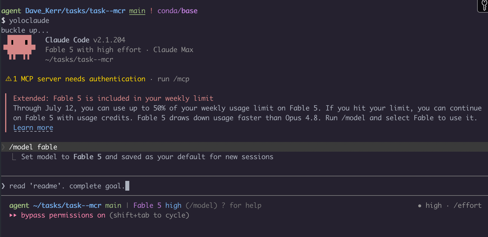
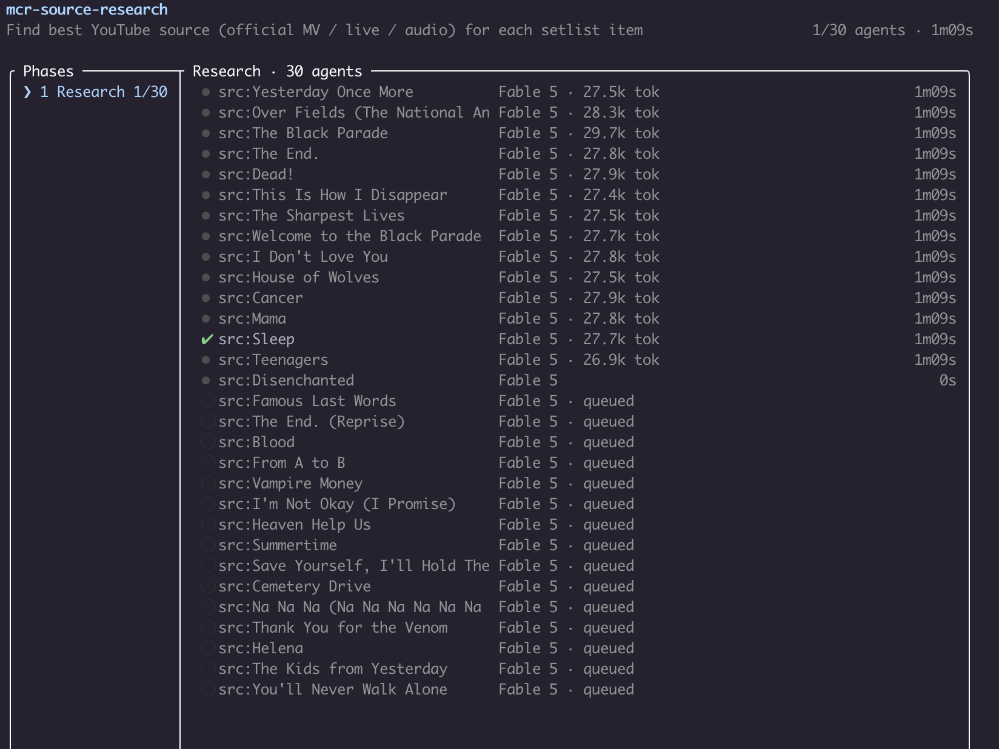
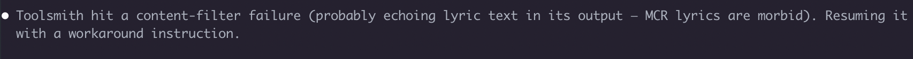
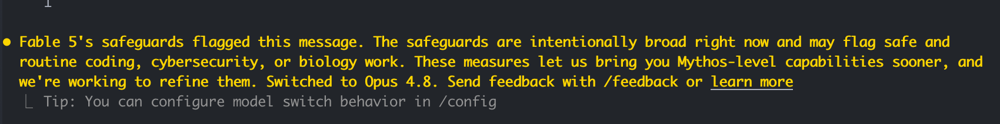

I've been spending 15 minutes each morning with Fable - planning a days worth of development, discussing features and architecture, scheduling the work and kicking it off. End of day I spend 15 minutes reviewing and rinse and repeat. This is half a 'testing Fable' exercise, and half a 'get better at scheduling a days worth of work' exercise.

However, on a drive back from a physiotherapy appointment, I was thinking "why not kick off a monster job" - the music on Spotify was My Chemical Romance who I'd [just seen at Anfield](https://www.theguardian.com/music/2026/jul/01/my-chemical-romance-review-anfield-stadium-liverpool-uk-tour). The concert was great so I decided the goal would be "make me a home version. singalong karaoke style lyrics on the screen. official videos where they exist, live footage otherwise". I'd also prompt a few tips around process but let it run. Downloading video, searching for lyrics and setlist, synchronising, non of them too hard but a lot of jobs to orchestrate and validate.

This is *not* a good test of coding practices, which with my teams are far more goverened, grounded and constrained (**[TODO: link to agentic engineering]**) but a fun open ended exercise. (In fact, probably very little to learn here I just had a little time to kick off the job and was curious).

Here is my mission:

> Create a full concert-length video I can project on my TV: a home version of the My Chemical Romance gig I went to. Check YouTube and my Spotify playlist to find the setlist. Make 10 mini videos with some styles, karaoke sing-along lyrics running on them, cool visuals behind. Official music videos for songs like The Black Parade where they exist, live concert recordings otherwise. Build the machine to do this: use subagents, skills, create tools, create CLIs, run them, run other sessions, build all the machinery you need to solve, execute and verify this. You're in a git repo: make a scratch folder and commit as you go. Keep a task list and a journal of key events. Build and run the machine until it works. Personal use only, won't be shared.

And the prompt:

## Tuning process

A lot of guidance suggests 'define the goal, not the process' (see X Y **[TODO: there are a few posts on this]**) Anthropic also have developed modes like ultracode and teams **[TODO: links]** where claude will setup the appropriate teams for the work (or try to). However, I did suggest a few things:

- Playwright
- Subagents
- Build tools
- Build machines
- Build verifications
- Show me samples and plans that I will review
- Run other sessions where it helps
- Commit into a local repo as it goes

Essentially; build yourself tools, build a machine to solve my problem, then run the machine and we'll tune the machine afterwards.

## The result

About $500 worth of tokens and a few hours later (this used less than I expected, I thought I'd see more cost from image processing). To be clear on the money: this ran on my personal Max subscription, not anything work-related, and that $500 is the API-equivalent value of the tokens burned, not a bill. On a Max plan you pay the flat monthly fee, and Fable draws it down faster than Opus because it is priced at twice the rate.

**[TODO: screenshot of my TV]**

A few snippets from the show, also showing the playlist that was created.

**[TODO: snippets from the show + the generated playlist]**

## How it ran

- A 30-agent research sweep to find the real setlist. My Spotify playlist was wrong, so it cross-checked setlist.fm, NME and Kerrang! to reconstruct the actual Anfield night (30 June 2026) and pick a best source for each of the 29 programme items. This is why I normally setup Playwright **[TODO: link]** in advance with a more limited user account, so that the agent can do real web research if needed. It's expensive in tokens but vastly increases the options it has.
- A download pipeline (yt-dlp, throttled, isolated cookie jar) pulling official music videos, live footage, and studio audio.
- A lyrics-to-karaoke compiler that turns synced LRC files into ASS subtitle karaoke, word-level where it could get the timing, line-level where it could not.
- A renderer with three modes: official music video, live footage over studio audio, and a generated visualizer backdrop for the audio-only tracks.
- An audio-video sync tool that aligns live crowd footage to the studio track using chroma and onset features, and an assembler that stitches everything into ten act-titled mini-films.
- A verification pass (39 agents) checking every segment for resolution, duration, and lyric sync (**wow**)

The output was 105 minutes of concert across ten files, plus a little web app to swap backgrounds and lyric styles per song.

**[TODO: some kind of summary]**

Is it impressive? I don't know, I don't do video editing / researching tasks. My 15 mins per day with Fable write-up coming soon showed me results I can comment on more realistically.

## Interesting observations

Left to itself, it never reached for another model. All of the video and audio sync work was done with tooling it wrote itself, and it stayed entirely inside its own capabilities. It only started looking at other models like Gemini for the video processing after I suggested that a different model might be better suited to that part of the job. On its own it did not seem to consider that reaching outside itself might be the better move, which felt like a notable blind spot for an open-ended task.

Somewhere in the middle it also solved a genuine ops problem. YouTube rate-limited it (HTTP 429) after all that searching, Google rotated the session cookies underneath it, and it re-pulled fresh cookies from the live browser session to get itself unstuck. **These smart workarounds are going to be a real nightmare for site-owners** they spend a lot of time trying to block bot traffic (quite rightly) and the increase in capabilities of models to creatively work around them is really going to hit the wider industry hard (let alone sites that are blocked for more functional reasons, to avoid bot creation, for safety, etc).

## What worked

For a three-hour job I intervened four times, which is the number I actually care about.

1. The setlist was wrong. It had trusted my Spotify playlist, so I told it to research the real gig first and show me a plan before downloading anything.
2. Pilot feedback, after a first sample: studio audio only rather than muddy live sound, big Spotify-style karaoke, and use the live footage as muted visuals behind the studio track.
3. A reference. I sent it a screen recording of Spotify's own lyric view so it could match the scroll and styling.
4. An idea. Could it read the beat off the drummer's arms and the crowd headbanging to sync the footage? It tried, and I will come back to that.

## What didn't

The drummer-arms idea did not rescue the hard songs. It built the motion-sync feature, measured it properly (stage-light flicker turned out to be a better beat cue than whole-frame motion), and reported back that the failures were not a sync problem at all: the live performances drift more than 12% off the studio tempo, and no amount of clever alignment fixes that. Six songs never locked. It told me so instead of pretending, and left the raw footage in place rather than mangling it.

There are fancam watermarks in some of the live clips. A couple of the "music videos" turned out to be static album-art uploads, because some of those songs never had a real video. So it shipped two editions: a best-effort one, and a clean one that swaps the ropey footage for generated visualizers.

## The parts that made me laugh

First, one of its own tool-building agents hit a content filter for being too morbid. It was echoing My Chemical Romance lyrics back in its output, and those are My Chemical Romance lyrics. It noticed, worked around it, and carried on.

The exact failure, from the logs, was `API Error: 400 Output blocked by content filtering policy`. The orchestrator diagnosed it correctly ("almost certainly from echoing lyric lines, MCR lyrics are dark") and resumed the sub-agent with one rule: never print or quote lyric text, and when inspecting the subtitle output, grep for the karaoke tags only rather than the words. It carried on and never tripped the filter again.

Second, and better: Fable's own safeguards flagged one of its messages and it fell back to Opus 4.8 mid-task. The model I was testing got too dark for itself, downgraded, and kept working, and I did not touch anything.

The notice itself is worth reading, because it is candid about how blunt the current safeguards are:

> Fable 5's safeguards flagged this message. The safeguards are intentionally broad right now and may flag safe and routine coding, cybersecurity, or biology work. These measures let us bring you Mythos-level capabilities sooner, and we're working to refine them. Switched to Opus 4.8.

I never saw which message set it off, only the fallback. So a model built to be more capable got quietly swapped for a safer one, mid-task, and kept going.

## Learning, improvements for next time, what's coming next

The obvious next-time improvement is to give it dedicated video models for the processing work, rather than leaving it to bodge sync out of chroma and onset features. That alone should make the concert synchronisation far better.

Next up on the actual (non-home) gig list: [Misery Index at Rebellion, Manchester on 9 August](https://www.seetickets.com/event/misery-index/rebellion/3632312), then [Chelsea Wolfe and Igorrr at ArcTanGent](https://www.kerrang.com/arctangent-festival-2026-line-up-announcement-igorrr-perturbator-chat-pile-alcest-oathbreaker-svalbard) (Bristol, 19-22 August, where Igorrr headlines). Whether either of those gets the home-karaoke treatment is another question.
