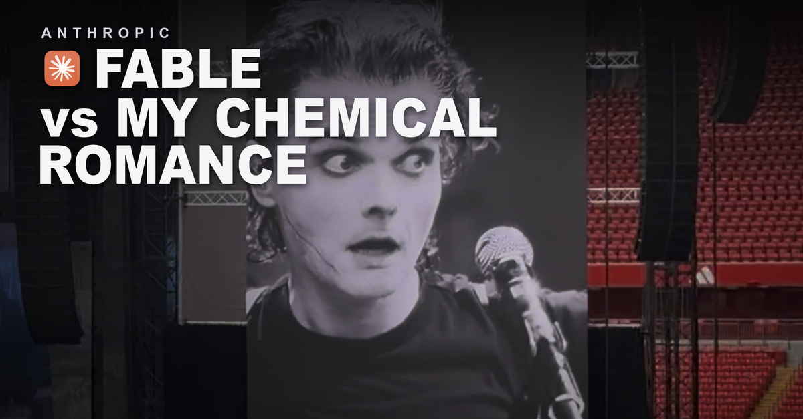
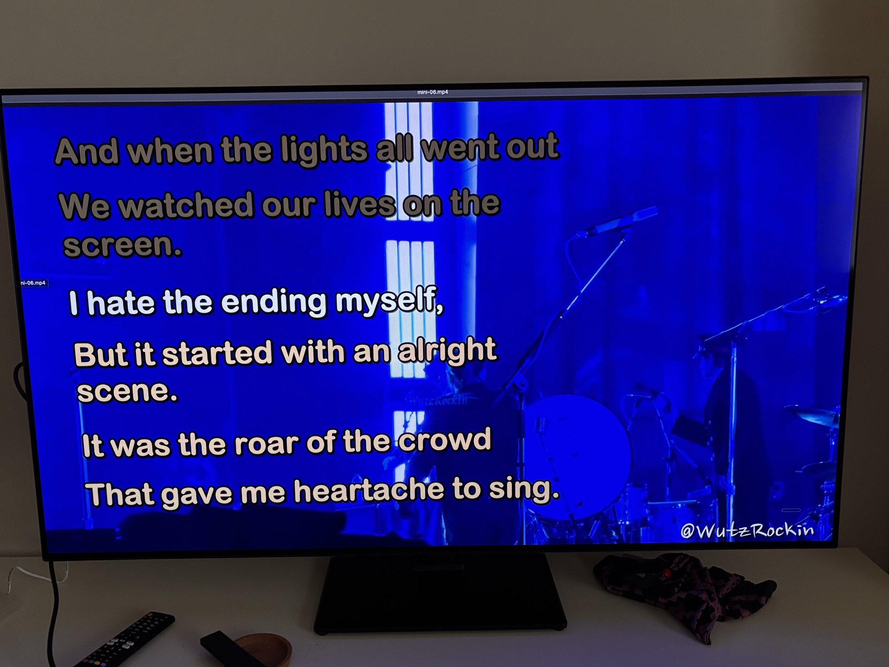
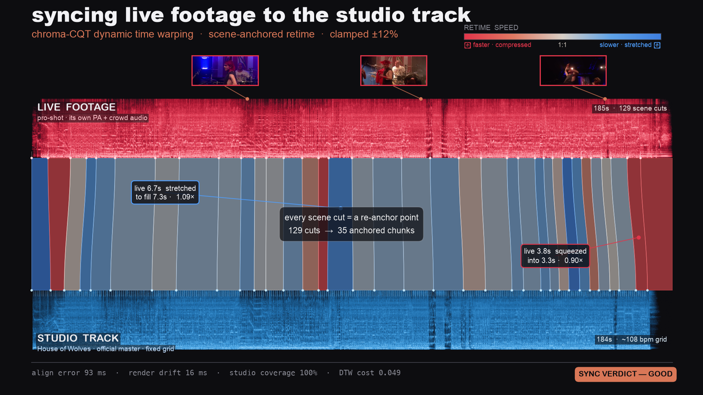

I've been spending 15 minutes each morning with Fable - planning a days worth of development, discussing features and architecture, scheduling the work and kicking it off. End of day I spend 15 minutes reviewing and rinse and repeat. This is half a 'testing Fable' exercise, and half a 'get better at scheduling a days worth of work' exercise. However, on a drive back from a physiotherapy appointment, I was thinking why not kick off a monster job? That would just be fun.

[](./images/v30.png)

At the time the music on Spotify was My Chemical Romance, who I'd [just seen at Anfield](https://www.theguardian.com/music/2026/jul/01/my-chemical-romance-review-anfield-stadium-liverpool-uk-tour). The concert was great so I decided the goal would be "make me a home version. singalong karaoke style lyrics on the screen. official videos where they exist, live footage otherwise". I'd also prompt a few tips around process but let it run.

This is not a good test of coding practices (with my teams that is a process of evolution as we work out how best to move towards [agentic engineering](/agentic-orchestration-protocols/)), just a fun open ended exercise.

I created a `README.md` with the following mission:

```text
Create a full concert-length video I can project on my TV: a home version of the
My Chemical Romance gig I went to. Check YouTube and my Spotify playlist to find
the setlist. Make 10 mini videos with some styles, karaoke sing-along lyrics
running on them, cool visuals behind. Official music videos for songs like The
Black Parade where they exist, live concert recordings otherwise. Build the
machine to do this: use subagents, skills, create tools, create CLIs, run them,
build all the machinery you need to solve, execute and verify this. You're in a
git repo: make a scratch folder and commit as you go. Keep a task list and a
journal of key events. Build and run the machine until it works. Personal use
only, won't be shared.
```

And the prompt:

[](./images/01-start-work.png)

## Tuning process

A lot of guidance suggests 'define the goal, not the process' (see [Think with Google](https://business.google.com/aunz/think/ai-excellence/agentic-marketing-ai-strategy/) and [this piece by Tyler Folkman](https://tylerfolkman.substack.com/p/prompt-engineering-is-over-i-built)). Anthropic have also built modes like [ultracode](https://claude.com/blog/introducing-dynamic-workflows-in-claude-code) and [teams](https://code.claude.com/docs/en/agent-teams) where Claude will set up the appropriate teams for the work (or try to). However, I did suggest a few things:

- Playwright for browser automation, to perform more complex searches and analysis
- Sub-agents, to preserve context
- Building small, simple tools that can be composed together into larger systems
- Building machines that use those tools
- Building verifications and checkpoints
- Creating a human-in-the-loop point where I can review samples and the execution plan

Essentially; build yourself tools, build a machine to solve my problem, then run the machine and we'll tune the machine afterwards.

## The result

About $500 worth of tokens and many hours later (this used less than I expected, I thought I'd see more cost from image processing). To be clear on the money: this ran on my personal Max subscription, not anything work-related, and that $500 is the API-equivalent value of the tokens burned, not a bill. On a Max plan you pay the flat monthly fee, and Fable draws it down faster than Opus because it is priced at twice the rate.

[](./images/tv.jpg)

## How it ran

Under the covers, after reviewing the execution plan and the session logs, this is roughly what happened.

- A 30-agent research sweep to work out the real setlist and find a good source for each of the programme items. Playwright let it compare sources and do real research on the open web, which is expensive in tokens but vastly increases the options it has.
- A pipeline to gather the source video and audio for each song.
- A lyrics-to-karaoke compiler that turns synced LRC files into ASS subtitle karaoke, word-level where it could get the timing, line-level where it could not.
- A renderer with three modes: official music video, live footage over studio audio, and a generated visualizer backdrop for the audio-only tracks.
- An audio-video sync tool that aligns live footage to the studio track using chroma and onset features, and an assembler that stitches everything into ten act-titled mini-films.
- A verification pass (39 agents) checking every segment for resolution, duration, and lyric sync. I rate this step highly; it mirrors the process I follow on many professional jobs.

[](./images/02-research.png)

The output was 105 minutes of concert across ten files, plus a little web app to swap backgrounds and lyric styles per song.

Is it impressive? I don't know, I don't do video editing / researching tasks. My 15 mins per day with Fable write-up coming soon showed me results I can comment on more realistically (a more complex software engineering project).

## The hardest part: syncing footage to studio audio

The bit that took the most work was using live concert footage as the visuals while playing the clean studio recording as the audio. A live band never plays at exactly the album tempo, so if you just mute the footage and drop the studio track underneath, the two drift apart. Within a minute the drummer is visibly hitting things you can't hear.

Here is how the machine solved it for one song, House of Wolves, with pro-shot footage:

[](./images/sync-process.png)

It takes a mel-spectrogram (a picture of the sound) of both the live audio and the studio master, then computes a mapping between them with chroma-CQT dynamic time warping, which matches on harmonic content rather than the raw waveform. The footage is chopped at every camera cut and each shot is placed on the studio timeline at its matched position, sped up or slowed down by an amount small enough not to notice (clamped to 12%, red for faster, blue for slower). The clever bit is re-anchoring at every camera cut: the eye already accepts a jump at a cut, so drift can only build up within a single shot, never across the whole song. Here 129 cuts became 35 anchored chunks, and it reports the honest numbers for the result (93ms alignment error, 100% coverage, verdict GOOD).

None of this was a technique I gave it. It researched the approach and built the tool itself, including working out the re-anchor-at-cuts trick on its own. The diagram here just visualises what it did, with the real numbers from the run.

## Interesting observations

For a job like this I only stepped in a handful of times. Probably the most meaningful suggestion I made was an idea: could it read the beat from the drummer's arms, the crowd head-banging and the stage lights flashing, and work out the rhythm that way? It went and tried.

Left to itself, it never reached for another model. All of the video and audio sync work was done with tooling it wrote itself, and it stayed entirely inside its own capabilities. It only started looking at other models like Gemini for the video processing after I suggested that a different model might be better suited to that part of the job. On its own it did not seem to consider that reaching outside itself might be the better move, which felt like a notable blind spot for an open-ended task.

The other thing that made me laugh: at one point Fable's own safeguards flagged one of its own messages and it fell back to Opus 4.8 mid-task, then carried on. Almost certainly the lyrical content again - My Chemical Romance lyrics are dark, and earlier one of its sub-agents had already tripped a content filter for echoing them back.

[](./images/fableblocked.png)

I don't think I'll run this exercise again - it was a bit of fun on the side that I thought I'd share before I get into my wider Fable experiments. I've got a couple of other gigs coming up anyway: [Misery Index](https://www.seetickets.com/event/misery-index/rebellion/3632312), [Chelsea Wolfe](https://www.chelseawolfe.net/) and [Igorrr](https://igorrr.com/).

If you want the real thing: [The Black Parade on Spotify](https://open.spotify.com/album/0FZK97MXMm5mUQ8mtudjuK) and [My Chemical Romance](https://www.mychemicalromance.com/). 🖤
