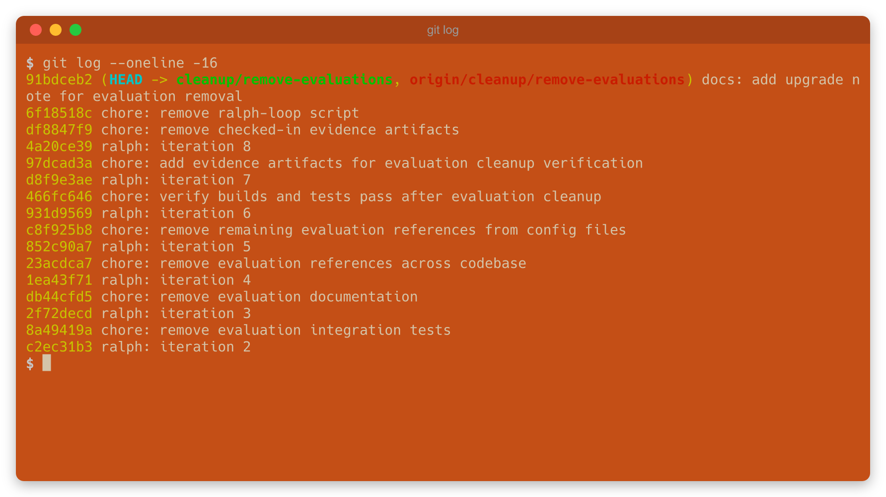

## The Ralph Wiggum Loop

The Ralph Wiggum Loop is one of the earliest and most simple agentic development patterns, a somewhat whimsical and silly approach to getting a coding agent to run continuously to solve a problem, with an extremely simple orchestration pattern. Ralph is not a pattern I'd really recommend for real-world problems but you'll see it around and hear about it and it's fun to explore and play with.

The pattern is simply "run an agent in a loop, with a single prompt, until it thinks it's done". Very few instructions, almost no orchestration at all, often with no intermediate steps tracked, it can be surprisingly effective for certain types of task. [Ralph Wiggum](https://simpsons.fandom.com/wiki/Ralph_Wiggum) is a character from The Simpsons who is not particularly smart but kind of good natured and persistent.

[](./ralphwiggum-smart.gif)

This is part of the Agentic Engineering Protocols series:

- [Agentic Engineering Protocols: Intro and Superpowers](/blog/agentic-orchestration-protocols/)

### What It Is

At its core, the Ralph protocol is an endless loop:

```bash
# Loop until claude thinks it's done...
while true; do
  # Run an agent such as claude with instructions".
  claude -p "Your desired end state description"
done

# Grab a cup of tea.
```

The prompt describes what done should be. Each iteration, the agent runs a single session, does some work, and exits. The loop feeds it the same prompt again.

No instructions on how to to the end state are included. No orchestration patterns are used. You're basically letting the agent figure it out. Typically it will change files, build and test, and repeat. The state of the code itself implies where the agent is in the process.

There's an [official Anthropic plugin](https://claude.com/plugins/ralph-loop) that adds stop hooks and completion detection, but the original Ralph that went viral is just a dumb loop.

## Why

Recent LLMs have pretty big context windows and agents are increasingly (somewhat disturbingly) smart. But at the time the loop was shared, context windows were smaller and failures were more common. In those cases the agent process (such as `claude`) would terminate early (for example due to running out of context). Typically some work would have been done, the code would be in an intermediate state, and then the next iteration picks up from there.

Increasingly complex tasks can be one-shot nowadays, context windows are huge, agents are far more smart, skills are more effective, subagents are more efficient, and this pattern is less common to see, but its fun to try it out.

### Ralph Wiggum vs a Tedious Task

My team had been wanting to move a large feature from our open source project [Ark](https://github.com/mckinsey/agents-at-scale-ark) (a Kubernetes based agentic toolkit) to our [marketplace](https://github.com/mckinsey/agents-at-scale-marketplace) of smaller modules. This means deleting a lot of code, eliminating tests, removing docs and cross references, screenshots, and so on. It's kind of tedious - remove stuff, test, rinse and repeat. Claude would probably one-shot it well given how [many integration tests and verifications we have as specs](https://github.com/mckinsey/agents-at-scale-ark/tree/main/tests). But I decided this was a good way to show off Ralph's style.

When we're adding code, we try to be rigorous. Specs, red/green tests, docs, skills to follow architectural patterns and so on. Reasonably careful orchestration, and a good amount of discussion if needed. Eliminating code is more straightforward.

## Running the Loop

We need to eliminate code from low-level operators, a CLI, two SDKs, docs, tests, deployments, pipelines, specs. We don't need to one shot it, we could quite easily ask the agent "remove a chunk, then stop and test" and then have it repeat this process.

Here's the loop (slightly simplified, [ralph-loop.sh](./ralph-loop.sh) is the original):

```bash
#!/bin/bash

# Seed a progress file for Claude to maintain between iterations.
touch progress.md

PROMPT='Evaluations are no longer core in Ark, we are moving them to a marketplace.
Remove the CRDs, docs, demos, integration tests, references, SDKs, UI, the lot.
Read progress.md for what has been done so far. Update it as you work.
Do one task, update progress.md, commit, then stop.'

while [ $ITERATIONS -lt 100 ]; do
  ITERATIONS=$((ITERATIONS + 1))

  echo "$PROMPT" | claude -p --dangerously-skip-permissions

  git add -A && git commit -m "ralph: iteration $ITERATIONS" --allow-empty

  sleep 5
done
```

Quite open ended, few notes on 'how', just what we want. I added instructions to track process in a file to make it easier to show what happened at the end, and we terminate the loop if the agent thinks it is fully complete (this is janky, don't do it, but it's in-line with common samples and shows the pattern, you're more likely to see claude loop saying it's got nothing to do and have to terminate it).

## What Happened

This took 8 iterations. Here's the git log:

[](./images/gitlog.png)

The [progress.md](./progress.md) is quite interesting (this is just a snippet):

```
### CI/CD and Infrastructure Removal Details
Edited 7 files:

.github/workflows/cicd.yaml:
- Removed ark-evaluator from xray-container-scan matrix
- Removed all install-evaluator references from setup-e2e calls
- Removed !evaluated from standard test chainsaw selector
- Removed e2e-tests-evaluated from report-coverage and check-release needs lists

.github/workflows/deploy.yml — removed ark-evaluator from deploy container build matrix

### Remaining References Found (iteration 6)
Searched entire codebase for evaluat references. Found and fixed:
- RBAC resource lists in broker tests and tenant charts
- Argo workflow evaluation templates
- Chainsaw summary script evaluation functions
- MCP tools evaluation status references
- README project description
- Architecture diagrams
- Claude skills referencing evaluator paths

Preserved (generic English, not Ark CRDs):
- "evaluation-driven methodology" in walkthrough docs
- "ease of evaluation" in disclaimer
- Langfuse/Phoenix observability descriptions
- Historical CHANGELOG entries
```

We eliminated tests, parts of the build pipeline, docs references, generated artifacts, skills, samples, demo workflows and so on.

The final PR is at [refactor: remove evaluations from core](https://github.com/mckinsey/agents-at-scale-ark/pull/1323).

451 files changed, 58,763 lines removed — which as a tech lead is a wonderful feeling. This will now be a pluggable module in our [marketplace](https://github.com/mckinsey/agents-at-scale-marketplace), easier to test in isolation and evolve at a higher pace. Our codebase is smaller and easier to work with.

The loop won't work if the agent has to ask for permissions, so I [YOLO-d it](https://github.com/dwmkerr/dotfiles/blob/main/shell.d/claude.sh) in a container, using a less-privileged identity (I have an over-engineered pattern for running work with different identities which I can share if anyone is interested).

### What the loop missed

There were a few things that didn't work.

The more complex integration tests failed. The repo has skills that explain how to run these tests locally, but the skill never fired and the integration tests weren't run. This we could potentially deal with using a pre-push hook or similar, although the suite is time-consuming.

A process that generates types in an SDK based on the resources in the cluster was not run, leaving us with some stale code. This has been a persistent problem we haven't got around to dealing with and an example of "if the process is so complex the LLM gets it wrong more than twice, it's too complex". It's on the backlog but run only occasionally.

One type that lived in the evaluations code was used elsewhere and got deleted. This would've been caught if the integration tests ran.

Asides from these issues, Ralph did a solid job at the mechanical work. The gaps are on our side - our agents should be configured to not believe that a piece of work is complete until all evidence says so. This could be as simple as improving the `CLAUDE.md` to say that when a shippable unit of work is done, integration tests must pass locally, a hook, or whatever. Everything like this is an opportunity to improve the overall software-engineering engine - if the agent doesn't one-shot it we improve the system and do better next time.

## Thoughts on Ralph

It's brilliant. A dumb loop with a great name. The work of AI is stressful and disregulating. Ralph brightened up my day. I can't see myself using the pattern, building the script, testing it and so on in a real-world task, but I really wanted to show it off.

For somewhat mindless "just go and make it happen" work it does an OK job. Nowadays I'd typically go for [teams](https://code.claude.com/docs/en/agent-teams) (writeup coming soon) for tasks where I am less specific about structure and orchestration. But if you have a chance give Ralph a go it's quite satisfying.

To try the [official plugin](https://claude.com/plugins/ralph-loop) in Claude, install it:

```bash
claude plugin marketplace add anthropics/claude-code
claude plugin install ralph-wiggum@claude-plugins-official
```

Then run it:

```
/ralph-loop "Your prompt here" --max-iterations 10 --completion-promise "DONE"
```

---

Agentic Engineering Protocols series:

- [Agentic Engineering Protocols: Intro and Superpowers](/blog/agentic-orchestration-protocols/)
